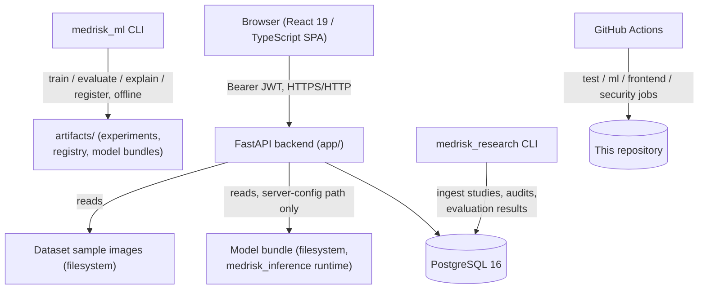
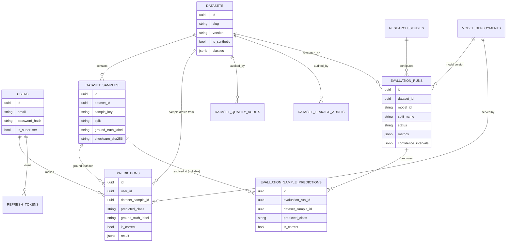
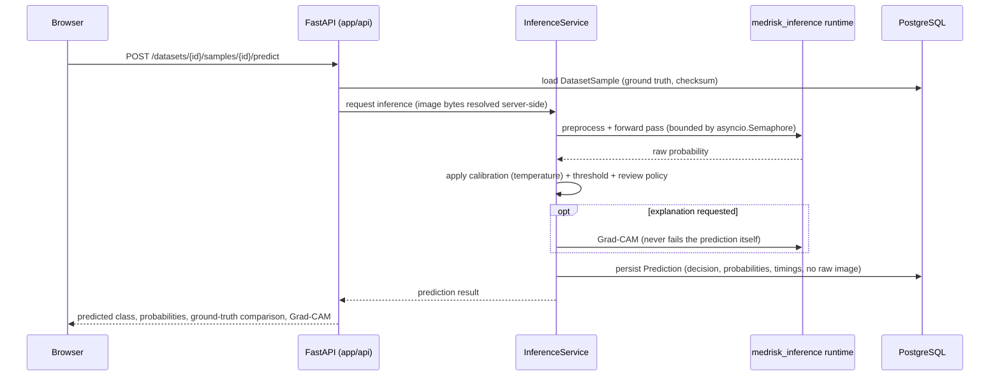

# Portfolio case study: MedRisk AI

A technical case study of MedRisk AI, written for a reviewer who wants to evaluate the
engineering rather than skim a feature list. Every claim below is checked against the actual
code, migrations, and test suite in this repository, not against an aspirational description.
For a faster, narrative walkthrough see [PRODUCT_WALKTHROUGH.md](PRODUCT_WALKTHROUGH.md); for
the evaluation protocol specifically see [RESEARCH_METHODOLOGY.md](RESEARCH_METHODOLOGY.md).

## 1. Abstract

MedRisk AI is a full-stack research and engineering platform built around one task: binary
histopathology image classification (tumor tissue present/absent in a patch's center region,
modeled on the PatchCamelyon/PCam benchmark). It implements every layer of a real ML product —
a typed FastAPI backend, a from-scratch PyTorch training and evaluation pipeline, a real-time
inference service with Grad-CAM explainability, a React/TypeScript frontend, and a research
evaluation layer that persists metrics, confusion matrices, and sample-level errors rather than
computing them ad hoc. The only model bundle and dataset shipped in this repository are
synthetic, and every surface that displays them says so explicitly. The system demonstrates the
engineering required to build and evaluate a medical-imaging classifier responsibly; it does
not demonstrate, and does not claim, a clinically validated diagnostic capability.

## 2. Research context

Histopathology slide classification is a well-studied but genuinely hard problem: patch-level
labels do not imply slide- or patient-level diagnostic performance, because patches from the
same slide are statistically correlated rather than independent; stain and scanner variation
across hospitals is a documented source of model failure; class imbalance and decision-threshold
selection require careful, leakage-free fitting; and explainability outputs such as Grad-CAM are
easy to over-interpret as more diagnostically meaningful than they are. This project is
structured around PCam (Veeling et al., 2018, MICCAI — see
[dataset-card-pcam.md](dataset-card-pcam.md)) as the target real dataset, while using a
synthetic generator for everything actually shipped, tested, and shown publicly.

## 3. Supported research questions

The platform is built to answer questions of this shape, once a real dataset and trained model
are substituted for the synthetic ones:

- Given a fixed train/validation/test split, what is a model's discriminative performance
  (ROC-AUC, PR-AUC) and operating-point performance (sensitivity, specificity, F1) on the held-out
  test split, evaluated exactly once?
- Is the model's predicted confidence calibrated — does an 80% confidence prediction turn out to
  be correct roughly 80% of the time?
- Which specific samples does the model get wrong, and is there a pattern (confidence range,
  class) in the errors?
- Does the dataset itself contain integrity problems (missing files, checksum mismatches, class
  imbalance, cross-split leakage) that would invalidate any metric computed from it?

The platform does **not** currently answer clinical questions (diagnostic accuracy on real
patients, generalization across hospitals/scanners, inter-rater agreement with pathologists) —
see [Section 4](#4-scope-and-clinical-safety-boundary).

## 4. Scope and clinical safety boundary

This is a research and engineering portfolio project, not a medical device, clinical decision
support tool, or path toward one. The boundary is enforced in several independent places, not
just in prose:

- The only model in the registry has `synthetic_only: true` and `eligible_for_demo: false` in
  its own manifest; `medrisk_inference` refuses to load a bundle where both fields are true
  outside an explicitly synthetic-allowed mode, and production configuration refuses to start
  with a synthetic bundle at all (`app/core/config.py`).
- There is no arbitrary-image-upload path in the public demo. A user can only run inference
  against a curated sample that already has a known ground-truth label
  (`POST /api/v1/datasets/{id}/samples/{id}/predict`) — the original "upload anything" flow was
  removed in Phase 6.
- Every prediction response, dataset card, and evaluation result carries an explicit disclaimer
  string, sourced from one place (`medrisk_ml.constants` / the frontend's `common.json`
  `disclaimer` key), not re-typed inconsistently across surfaces.
- `POST /api/v1/predictions/survival` is an honest `501 Not Implemented` — there is no survival
  model, and the endpoint does not pretend otherwise.

## 5. System architecture

Three packages never import each other directly: `app/` (the live API), `medrisk_ml/` (offline
training and evaluation), and `medrisk_inference/` (the bridge that loads a verified bundle and
serves it inside `app/`). This is enforced by a dedicated import-isolation test, not just a
comment — the live API process has no `numpy`/`torch`/`sklearn` dependency at all unless
`medrisk_inference`'s lean dependency set is installed for serving. There is no message queue,
no container orchestration platform, and no microservice boundary beyond what this diagram
shows; the architecture is deliberately a modular monolith.

## 6. Data model

The schema spans four functional areas: accounts/auth, prediction history, the dataset registry
(Phase 6), and the research/evaluation layer (Phase 7). The diagram below is a simplified view
of the actual SQLAlchemy models (`app/models/`); column lists are abbreviated to what matters
for understanding the relationships.

Notable design choices visible in the schema itself:

- `Prediction.dataset_sample_id` and `ground_truth_label` are nullable — a prediction made
  against an arbitrary historical upload (pre-Phase-6) never gets a fabricated ground truth.
- `EvaluationSamplePrediction.dataset_sample_id` is also nullable: not every evaluated sample
  from an offline `medrisk_ml` run can be resolved back to a Phase 6 registry row (see
  [Section 7](#7-controlled-dataset-workflow)). The unresolved count is recorded honestly in
  `EvaluationRun.notes` rather than hidden.
- Neither `datasets` nor `dataset_samples` stores image bytes; `relative_path` is resolved to an
  absolute filesystem path exclusively server-side and is never present in any API response.

## 7. Controlled dataset workflow

A `Dataset` row describes one versioned, browsable collection (today: the in-repo synthetic
demonstration dataset, `synthetic-histopathology-demo` v1.0.0, 50 samples across train/val/test).
Each `DatasetSample` row carries a known `ground_truth_label`, a `split`, a SHA-256
`checksum_sha256`, and dimensions, with the actual file addressed only by a server-resolved
`relative_path`. The frontend's dataset explorer (`/app/datasets`) reads this registry directly;
there is no path from the public demo to an arbitrary, unregistered image.

A documented honest gap: the `medrisk_ml` smoke-training run used a different generated subset
(64/32/32 samples) than the web-facing registry seed (30/10/10), so when the two are reconciled
during evaluation ingestion, only the overlapping sample keys resolve to a `DatasetSample` row —
the rest are recorded as unresolved in `EvaluationRun.notes`, not silently dropped or faked.

## 8. Inference workflow

The model runtime is loaded once at process startup (`lifespan`) and shared by every request —
there is no per-request reload and no hot-swap; changing the active model means restarting the
process with a different `MODEL_BUNDLE_PATH`. Concurrency is bounded by an `asyncio.Semaphore`
plus separate queue-wait and inference-deadline timeouts, so a slow model can degrade gracefully
rather than blocking the rest of the API. Image input is treated as hostile: byte-capped reads,
a decompression-bomb guard, MIME/format cross-checks, and EXIF stripping by reconstructing the
image from a fresh pixel buffer rather than filtering metadata after the fact (see
[docs/inference-security.md](inference-security.md)). A Grad-CAM failure degrades to an explicit
`explanation_status`, never a failed prediction.

## 9. Evaluation methodology

An `EvaluationRun` is one deterministic evaluation pass: one model version, one dataset version,
one split, evaluated once. Per the Phase 7 design, a run with `status=completed` is treated as
immutable everywhere in this codebase — re-evaluating creates a new row; nothing edits a
completed run's metrics or predictions in place. The decision threshold and any calibration
temperature are always fit on the validation split and frozen before the test split is touched;
`medrisk_ml.evaluation.thresholding.select_threshold` raises `SplitLeakageError` if asked to fit
on `test`, and `app.research.domain.policy.reject_test_split_fitting` re-enforces the same rule
at the API/config level — two independent layers, not one. The live API process never recomputes
a metric: every number an `EvaluationRun` exposes was computed offline by `medrisk_ml` (or
ingested from a completed run) and is only ever read back.

## 10. Implemented metrics

All scalar metrics below are computed offline and shaped through
`app.research.domain.metric_shaping.shape_scalar_metrics` before being persisted, which converts
any mathematically undefined value (`NaN`) into an explicit `{"status": "undefined", "reason":
...}` record rather than ever writing `NaN` into a JSONB column or silently turning "undefined"
into `0.0`.

| Metric | Definition | Interpretation | Limitations / edge cases |
|---|---|---|---|
| **Accuracy** | (TP + TN) / total samples | Overall fraction correctly classified. | Misleading under class imbalance — a 95:5 split can score 95% accuracy by always predicting the majority class. |
| **Balanced accuracy** | (sensitivity + specificity) / 2 | Accuracy corrected for class imbalance. | Undefined if sensitivity or specificity is itself undefined (no positive or no negative samples). |
| **Precision** | TP / (TP + FP) | Of samples predicted positive, the fraction actually positive. | Undefined when TP + FP = 0 (no positive predictions were made at all). |
| **Recall / sensitivity** | TP / (TP + FN) | Of samples actually positive, the fraction the model caught. | Undefined when TP + FN = 0 (no actual positives in the split). |
| **Specificity** | TN / (TN + FP) | Of samples actually negative, the fraction correctly identified. | Undefined when TN + FP = 0 (no actual negatives in the split). |
| **F1** | Harmonic mean of precision and recall | Single number trading off precision and recall. | Undefined when precision and recall are both zero or undefined. |
| **ROC-AUC** | Area under the ROC curve (TPR vs. FPR across thresholds) | Threshold-independent ranking quality. | Undefined when only one ground-truth class is present in the split — there is nothing to rank against. |
| **PR-AUC** | Area under the precision-recall curve | Ranking quality focused on the positive class; more informative than ROC-AUC under heavy imbalance. | Same single-class undefined case as ROC-AUC. |
| **Brier score** | Mean squared error between predicted probability and the 0/1 outcome | Calibration-sensitive accuracy measure — lower is better. | Always defined, but only meaningful alongside a calibration curve, not as a standalone "accuracy" number. |

Confusion-matrix counts (`true_positive`, `true_negative`, `false_positive`, `false_negative`,
`sample_count`, `positive_count`, `negative_count`) are always-defined integers and are exposed
unshaped via `extract_counts`. Confidence intervals (bootstrap, validation-fit confidence level)
and calibration metrics (temperature-scaling result) are persisted as separate JSONB columns on
`EvaluationRun` and rendered by the frontend's `MetricsPanel` without re-derivation.

## 11. Confusion matrix interpretation

The confusion matrix panel renders ground-truth rows against predicted-class columns, with each
cell showing both the raw count and the row-normalized percentage (e.g. "16 (100%)" for the
negative/negative cell). Reading it: the diagonal (true negative, true positive) is correct
predictions; off-diagonal cells are the two error types this project's error analysis
distinguishes — a false positive (predicted positive, actually negative) and a false negative
(predicted negative, actually positive), which carry different real-world cost in a diagnostic
context even though this project does not draw clinical conclusions from either.

## 12. Sample-level error analysis

`GET /research/evaluations/{id}/errors` exposes one row per evaluated sample
(`EvaluationSamplePrediction`), filterable by correctness, with the sample's ground-truth label,
predicted class, and confidence. This lets a reviewer move from an aggregate number (e.g. "5
false negatives") to the exact samples responsible, which is the level of traceability needed to
investigate whether errors cluster around a particular confidence range or input characteristic.
The same per-sample rows back the offline `error_analysis.csv`/`.md` artifacts written by
`medrisk_ml`'s evaluation step.

## 13. Grad-CAM explainability

Grad-CAM is implemented from scratch (not via a third-party explainability library), computing a
class-activation heatmap from the gradient of the target class score with respect to a
convolutional feature map, then overlaying it on the input image. Every Grad-CAM output —
whether from the offline pipeline or the live inference endpoint — carries a disclaimer:
Grad-CAM identifies image regions associated with the selected class score; it does not prove
causal reasoning, clinical validity, or prediction correctness. An explanation failure is
designed to degrade to an explicit `explanation_status` rather than fail the prediction itself,
since a missing heatmap should never block a result a user is otherwise entitled to see.

## 14. Dataset quality and leakage analysis

Two independent, persisted audits exist, both runnable against the live dataset registry without
any ML dependency (pure SQL/filesystem checks, `app/research/services/`):

**Quality audit** (`dataset_quality_service.py`): per-split and per-class sample counts, a class
imbalance ratio (`max(class count) / min(class count)`, flagged above 3:1), image dimension and
MIME-type distribution, duplicate-checksum and path-collision detection, and a filesystem
cross-check (every registered sample's file must exist and its current checksum must match the
registered one) — this catches the common real failure mode of a sample row pointing at a
deleted, moved, or corrupted file.

**Leakage audit** (`leakage_audit_service.py`): exact cross-split overlap by file checksum or
on-disk path, conflicting-label detection (same checksum, different label), and group-level
(subject/patient/slide) overlap — evaluated only when the dataset's sample metadata actually
carries a recognized grouping key, and explicitly reported as "could not be evaluated" rather
than assumed clean when it doesn't. Both audits report `checks_not_performed` explicitly:
perceptual-hash near-duplicate detection is not implemented, and image-decode (corrupt pixel
data) validation is out of scope because it would require a Pillow dependency not guaranteed
present in every API image variant.

## 15. Security architecture

JWT access tokens (15-minute expiry) and rotating, revocable refresh tokens (7-day expiry,
single-use rotation), Argon2 password hashing, and a 32-character-minimum production
`JWT_SECRET_KEY` with a weak-secret blocklist (`app/core/security.py`,
`app/core/config.py`). Authorization is enforced server-side at three tiers: public (no token),
authenticated (`CurrentUserDep`, any registered user), and administrator
(`CurrentSuperuserDep`, gated on `User.is_superuser`) for the three research write endpoints
(`POST .../quality-audit`, `.../leakage-audit`, `/research/evaluations`). A per-process
sliding-window rate limiter (`app/core/rate_limit.py`) protects login, registration, token
refresh, both inference endpoints, and the research write endpoints. Full detail:
[security.md](security.md), [inference-security.md](inference-security.md).

## 16. Threat model summary

[THREAT_MODEL.md](THREAT_MODEL.md) enumerates 26 specific threats against this architecture
(credential leakage, broken authentication/authorization, SQL/command injection, path traversal,
malicious file handling, unsafe model deserialization, DoS via request volume, token theft, CORS
misconfiguration, dependency CVEs, tampered model/dataset artifacts, and misleading
research-result manipulation), each with its current control, residual risk, and verification
status (`Verified-repository` / `Verified-test` / `Partially verified` / `Not-verified`). This is
a self-administered review, explicitly distinguished in [SECURITY_AUDIT.md](SECURITY_AUDIT.md)
from a penetration test that has not been performed.

## 17. Reproducibility

Every trained model's manifest records its dataset name/version/mode, git commit, and full
validation/test metrics computed once (`artifacts/model_registry/<model>/<version>/manifest.json`).
Every `EvaluationRun` records a `protocol_hash` (a hash of the resolved study configuration) and
an `artifact_manifest` (paths/checksums of the artifacts the run was derived from), so a number
shown in the frontend can be traced back to the exact configuration and sample set that produced
it. `research/references.yaml` holds independently verified citations (Grad-CAM, PCam,
scikit-learn, PyTorch) with verification dates, rather than inline unverifiable claims.

## 18. Verification strategy

Backend integration tests run against a real PostgreSQL test database (`TEST_DATABASE_URL`) —
never SQLite, never mocked — with `tests/conftest.py` building a small, deterministic, synthetic
model bundle once per test session so every test that boots the app loads a real, verified (if
synthetic) model. ML pipeline tests run entirely on synthetic, generated data: no network access,
no real dataset, fully deterministic. Frontend tests use Vitest + React Testing Library with a
mocked API layer (MSW). An import-isolation test enforces that `app/`, `medrisk_ml/`, and
`medrisk_inference/` never cross-import. See [Section 19](#19-verified-results) for this
session's actual execution results.

## 19. Verified results

This section reports only what was executed and observed during the most recent verification
pass for this documentation update — see the repository's CI configuration
(`.github/workflows/ci.yml`) for the canonical, continuously re-run gate, and
[PHASE_8_PROGRESS.md](PHASE_8_PROGRESS.md) for the historical test counts from earlier phases.
Exact commands and counts from this session are recorded in this repository's commit history and
in the agent's final completion report for this change; they are intentionally not duplicated
here to avoid a second copy silently going stale.

## 20. Limitations

See [KNOWN_LIMITATIONS.md](KNOWN_LIMITATIONS.md) for the complete, no-spin list. The short
version: no clinical validation, no externally validated dataset, no real (non-synthetic)
trained model, no public deployment, per-process (not distributed) rate limiting, no account
lockout, and no independent security review or penetration test.

## 21. Future research and engineering work

A real, PCam-trained (non-synthetic) model bundle — the actual blocker to any public deployment
or clinically-framed demo, not an infrastructure gap (see [DEPLOYMENT.md](DEPLOYMENT.md)).
Perceptual-hash near-duplicate and subject-level leakage detection beyond exact-checksum overlap.
A model-comparison view with paired statistical tests across evaluation runs. Distributed rate
limiting if this project ever runs multiple worker processes. Production-grade model monitoring
and drift detection beyond the existing `model_deployments` audit trail.

## 22. Conclusion

MedRisk AI demonstrates the full engineering stack required to build, serve, and evaluate a
medical-imaging classifier with the leakage-safety, auditability, and explainability practices a
real deployment would need — without claiming the clinical validation it has not undergone. The
honesty of that boundary, enforced structurally rather than only in documentation, is the part
of this project most worth reviewing closely.

## 23. Ten-minute reviewer walkthrough

1. Read the medical disclaimer on the landing page, then register a throwaway account and open
   the dashboard (`/app`) — note the "Active model" card states the model version and
   architecture explicitly.
2. Open the dataset explorer (`/app/datasets`), open the one registered dataset, and open a
   single sample — note the ground truth label and checksum are shown *before* you run anything.
3. Run inference on that sample. Read the ground-truth comparison panel and the Grad-CAM overlay,
   and note both disclaimers (research-only, synthetic-model) are shown directly above the
   result, not buried in a footer.
4. Open prediction history (`/app/predictions`) to see the same prediction persisted and
   re-readable.
5. Open the research evaluation overview (`/app/research`), then the one completed evaluation
   run — read the metrics panel, the confusion matrix, and at least three rows of the per-sample
   error table.
6. Cross-check one of [KNOWN_LIMITATIONS.md](KNOWN_LIMITATIONS.md)'s claims (e.g. "no account
   lockout") against `app/core/rate_limit.py` and `tests/unit/test_rate_limit.py` to confirm the
   documentation matches the code, not just itself.
