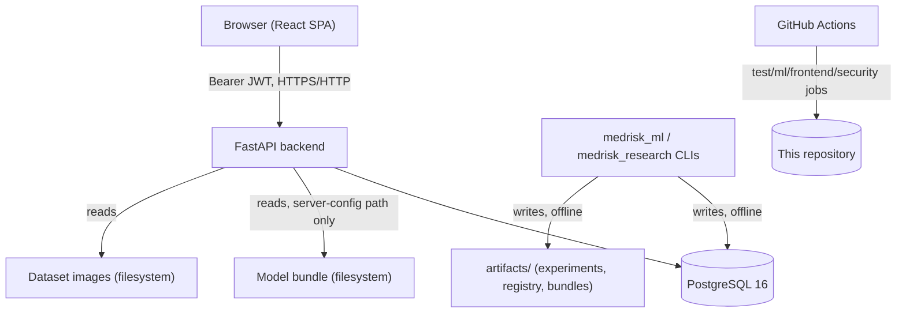

# Portfolio case study: MedRisk AI

## 30-second recruiter summary

MedRisk AI is a full-stack histopathology image-classification platform, built solo across 8
phases: a FastAPI/PostgreSQL backend, a from-scratch reproducible PyTorch training/evaluation
pipeline, a real (synthetic-model) inference API with Grad-CAM explainability, a React/
TypeScript frontend, and a scientific evaluation layer with leakage audits, NaN-safe metrics,
confidence intervals, and model/dataset cards. Phase 8 added rate limiting, admin-only
authorization on write endpoints, a self-administered security audit, and the documentation
set this file is part of. It is **not** a clinically validated system and says so on every
relevant page — the engineering is real, the medical claim deliberately is not.

## 5-minute technical walkthrough

1. **Backend** (`app/`): FastAPI + async SQLAlchemy 2.0 + PostgreSQL 16 + Alembic, JWT auth
   (access + rotating/revocable refresh tokens), repository/service layering, integration
   tests against a real Postgres database (never SQLite, never mocked).
2. **ML pipeline** (`medrisk_ml/`): fully independent of the API. Typed experiment config,
   a from-scratch CNN and a ResNet18 transfer-learning model, a training engine with early
   stopping/checkpointing/mixed precision, leakage-safe evaluation (threshold + calibration
   fit on validation only, test split evaluated exactly once), Grad-CAM from scratch, a
   file-based model/experiment registry, and a self-verifying portable model bundle.
3. **Inference bridge** (`medrisk_inference/`): loads a verified bundle once at process
   startup, never per request; validates uploads as hostile input (decompression-bomb guard,
   EXIF stripping, MIME cross-check); runs a calibration→threshold→review-policy decision
   pipeline; bounds concurrency with an `asyncio.Semaphore`. `app/` and `medrisk_ml/` never
   import each other directly — this package is the only bridge.
4. **Research/evaluation layer** (`app/research/`, `medrisk_research/`, Phase 7): formal
   study configuration, dataset quality/leakage audits (pure SQL, no ML deps in the live
   API), evaluation runs with metrics that are computed offline once and only ever read back
   — the live API process has no numpy/sklearn at all, so it structurally cannot fabricate or
   recompute a number.
5. **Frontend** (`frontend/`, Phases 4-7): React 19 + TypeScript + Vite, a public/
   authenticated route split enforced both client-side (`ProtectedRoute`) and server-side
   (every mutating endpoint requires a bearer token regardless of what the UI shows), a
   controlled dataset-sample research demo (no arbitrary upload), and a results UI for the
   evaluation layer above.
6. **Phase 8**: closed the gap between "working demo" and "safe to point a recruiter at" —
   rate limiting, admin authorization on the three endpoints that actually mutate research
   state, dependency/secret CI scanning, and the documentation set linked from the README.

## Why histopathology classification is technically challenging

Beyond "train a CNN": patch-level labels don't imply slide- or patient-level diagnostic
performance (patches from the same slide are correlated, not independent); stain/scanner
shift across hospitals is a well-documented failure mode this project doesn't claim to solve;
class imbalance and threshold selection require validation-only fitting to avoid silently
inflating test-set numbers; and any explainability output (Grad-CAM) needs an explicit
disclaimer because a heatmap is easy to over-interpret as more diagnostic than it is. See
[dataset-card-pcam.md](dataset-card-pcam.md) for the specifics this project documents rather
than glosses over.

## Product and research boundaries

Public/authenticated/admin access model, enforced server-side — full detail in
[THREAT_MODEL.md](THREAT_MODEL.md) "Public / authenticated / admin boundary." The short
version: anyone can read the research results and methodology; only a logged-in user can run
controlled inference on a curated sample; only an administrator (`is_superuser`) can trigger
a dataset audit or create an evaluation run. No one can upload an arbitrary image as a
"diagnosis," because that flow was deliberately removed in Phase 6.

## System architecture

This is the real architecture — no message queue, no Kubernetes cluster, no microservices
exist in this project, and this diagram does not invent any.

## Dataset lifecycle

Registered via `datasets`/`dataset_samples` (Postgres, metadata only — image bytes on disk,
addressed only by server-resolved `relative_path`, never a client-supplied path). Quality and
leakage audits (Phase 7) run against the registry directly: empty/missing-split checks, class
imbalance, duplicate/mismatched checksums, cross-split checksum overlap. See
[DATA_AND_MODEL_PROVENANCE.md](DATA_AND_MODEL_PROVENANCE.md) for what's actually in the
registry today (100% synthetic) versus what's gated-but-supported (real PCam).

## Model lifecycle

Train (`medrisk_ml.cli train`) → evaluate (val-only threshold/calibration, test run once) →
explain (Grad-CAM) → register (`medrisk_ml.cli register`, builds a SHA-256-verified portable
bundle) → load once at API startup → serve. A model never gets a second life cycle within
one process: changing the active model means restarting the process with a different
`MODEL_BUNDLE_PATH`, by design (see [model-deployment.md](model-deployment.md)).

## Training and evaluation separation / leakage safeguards

The test split is evaluated exactly once, after the decision threshold and calibration
temperature are frozen on the validation split (`SplitLeakageError` if code tries to fit
either on test — see `medrisk_ml/evaluation/thresholding.py`). Phase 7's `StudyConfig` schema
independently re-enforces this at the configuration level (`Literal["val"]`-typed +
validator-enforced ban on calibrating/thresholding on `test`). The dataset leakage audit
checks for exact cross-split checksum overlap and honestly reports "could not be evaluated"
when no subject/patient identifier exists, rather than fabricating a pass.

## Reproducibility strategy

Every trained model's manifest records its dataset name/version/mode, git commit, and full
metrics (validation and test, computed once). Every evaluation run persisted through Phase 7
records a protocol hash and an artifact manifest. `research/references.yaml` holds
independently-verified citations (Grad-CAM, PCam, scikit-learn, PyTorch) rather than inline,
unverifiable claims.

## Model registry / evaluation registry

File-based (`artifacts/registry/experiments.jsonl`, `artifacts/model_registry/<model>/
<version>/`) for the ML pipeline; Postgres-backed (`evaluation_runs`,
`evaluation_sample_predictions`) for what the live API and frontend can read. The two are
deliberately not the same store — the ML registry is the offline source of truth; the
Postgres tables are what got *ingested* from it, with an honest record of any rows that
couldn't be linked (see [PHASE_7_PROGRESS.md](PHASE_7_PROGRESS.md) "Decision 6").

## Grad-CAM integration

Implemented from scratch (not a library), with a mandatory disclaimer on every output, and a
design constraint that an explanation failure can never fail an otherwise-successful
prediction (it degrades to an explicit `explanation_status`, not a 500).

## Error analysis / calibration

Per-sample error records (false positive/negative breakdown) are queryable through
`GET /research/evaluations/{id}/errors` with confidence-range filters. Temperature-scaling
calibration is fit on validation only and its result (a single temperature scalar) is
persisted and served back — not recomputed by the API, which has no numpy/sklearn at all.

## Backend / frontend / auth / database architecture

See [architecture.md](architecture.md) (backend), `frontend/README.md` (frontend),
[security.md](security.md) + [THREAT_MODEL.md](THREAT_MODEL.md) (auth/authorization), and
[database.md](database.md) + [DATABASE_RELEASE_AND_ROLLBACK.md](DATABASE_RELEASE_AND_ROLLBACK.md)
(schema/migrations/rollback). Not re-summarized here to avoid drift between two descriptions
of the same thing — those are the source of truth.

## Docker environment / CI/CD / security controls / public-demo design

See [DEPLOYMENT.md](DEPLOYMENT.md) (containers, chosen-but-unexecuted deployment target),
the `frontend`/`security` jobs added to `.github/workflows/ci.yml` in Phase 8, and
[SECURITY_AUDIT.md](SECURITY_AUDIT.md)/[THREAT_MODEL.md](THREAT_MODEL.md) for everything
security-related. The public-demo design (golden path: landing → curated sample → prediction
→ Grad-CAM → ground-truth comparison → model/dataset card → evaluation results) is
implemented in the frontend's `/`, `/app/datasets/*`, and `/app/research/*` routes — see
[THREAT_MODEL.md](THREAT_MODEL.md) "Public / authenticated / admin boundary" for exactly
which of those require login.

## Important engineering decisions and trade-offs

- **Two separate dependency tiers** (`requirements.txt` for the live API, with zero
  numpy/torch/sklearn; `requirements-ml.txt`/`requirements-inference.txt` for offline
  training and the inference add-on respectively) — enforced by a dedicated import-isolation
  test, not just a comment. Trade-off: the live API can never recompute a metric itself,
  which is exactly the point (Phase 7's "metrics are never recomputed by the API" guarantee
  falls directly out of this earlier Phase 1-3 decision).
- **One model per process, no hot-swap** — simpler concurrency/memory model at the cost of a
  restart to change models. Accepted because this project's actual model-change frequency is
  near zero.
- **Synthetic data as the default everywhere** — every phase's tests, CI, and the public demo
  itself run on generated data by default, with real PCam strictly opt-in and never
  auto-downloaded. Trade-off: the public demo cannot currently show a real diagnostic result
  — accepted deliberately, see [DEPLOYMENT.md](DEPLOYMENT.md).
- **`is_superuser` existed since Phase 1 but was unenforced until Phase 8** — a real example
  of a security gap that sat in the schema, visible to anyone reading the model, until an
  explicit audit (this phase) connected it to the endpoints that needed it.

## Problems encountered and how they were solved

- **Phase 6/7**: the medrisk_ml-side smoke experiment and the Postgres dataset registry were
  independently materialized from the same generator with different subset sizes, so only
  10/32 sample keys overlapped on ingestion. Solved by leaving the unmatched rows'
  `dataset_sample_id` nullable and recording the exact unresolved count on the evaluation
  run, rather than fabricating a 1:1 mapping.
- **Phase 8**: adding rate limiting risked breaking the existing 300+ integration tests,
  which all share one client identity (httpx `ASGITransport` always presents the same client
  address) across hundreds of login/register calls in the same test process. Solved by
  disabling rate limiting via a real environment variable for the whole test session
  (mirroring this repo's existing convention for `MODEL_REQUIRED`/`ALLOW_SYNTHETIC_MODEL` in
  `tests/conftest.py`) and testing the limiter's actual logic in isolation instead.
- **Phase 8**: a brand-new `pip-audit` CI job would have been permanently red on day one
  because the pinned `torch==2.11.0` has a published CVE. Solved by reading what the CVE
  actually requires (`torch.jit.script`, never called in this codebase), documenting the
  finding instead of hiding it, and explicitly ignoring just that one CVE ID in CI — so the
  gate still catches a genuinely new vulnerability tomorrow.

## What is real

The backend, ML pipeline, inference serving, frontend, dataset/research registries,
evaluation metrics math, leakage detection logic, and every test suite are real, working
code, exercised against a real PostgreSQL database and a real running API process every
phase (not mocked).

## What is synthetic

Every dataset sample and the one registered model bundle currently in this repository are
synthetic — generated by `SyntheticHistopathologyDataset`, never real tissue. Every surface
that displays them labels this explicitly. See
[DATA_AND_MODEL_PROVENANCE.md](DATA_AND_MODEL_PROVENANCE.md).

## What is not implemented

Near-duplicate/perceptual-hash leakage detection, subject-level leakage detection (no subject
identifier exists in the synthetic data), model comparison + paired statistical tests, a
web-triggerable re-calibration flow, a dedicated HTML research-report template, a real
(non-synthetic) trained model, and any public deployment. Full list:
[KNOWN_LIMITATIONS.md](KNOWN_LIMITATIONS.md).

## Known limitations

See [KNOWN_LIMITATIONS.md](KNOWN_LIMITATIONS.md) — not duplicated here.

## Future work

A real PCam-trained model (the actual blocker to a public deployment, see
[DEPLOYMENT.md](DEPLOYMENT.md)), distributed rate limiting if this ever runs multiple worker
processes, a real deployment with CSP/security headers verified against a live response, and
the "not implemented" items above.

## Skills demonstrated

Async Python web backend design; typed ORM modeling and migration discipline; JWT
auth/refresh-token rotation; from-scratch PyTorch model/training/evaluation/explainability
code (not just calling a library); leakage-safe ML evaluation methodology; React/TypeScript
frontend with enforced auth boundaries; CI pipeline design (multi-job, dependency caching,
security scanning); self-administered security threat modeling and audit; technical writing
that distinguishes verified claims from aspirational ones.

## Suggested interview discussion topics

- **How did you prevent data leakage?** Threshold/calibration fit on validation only, test
  split evaluated exactly once, enforced by a `SplitLeakageError` guard and independently
  re-enforced in the Phase 7 study-config schema — two layers, not one.
- **Why is evaluation separated from training?** So a model's reported performance reflects
  data it never influenced its own decision threshold or calibration on — fitting those on
  test data is one of the most common silent sources of inflated reported accuracy.
- **How are model artifacts versioned?** A `model_id:version` pair, a manifest with a
  checksum (`SHA256SUMS`), and a portable bundle directory — verified at every load, not
  just at registration.
- **How do you verify dataset compatibility?** `manifest.positive_class` must be in
  `manifest.class_names`; bundle loading rejects mismatches explicitly rather than silently
  proceeding with a wrong index.
- **Why is calibration important?** A model can be discriminative (good ROC-AUC) but
  miscalibrated (its "80% confident" predictions aren't right 80% of the time) — temperature
  scaling, fit on validation only, corrects for this without touching the decision threshold
  logic.
- **How do you avoid exposing private medical data?** Structurally, not just by policy: there
  is no column wide enough to hold a raw image; raw uploads are never persisted; EXIF is
  stripped by reconstruction, not filtered after the fact — see
  [inference-security.md](inference-security.md).
- **How is authorization enforced?** Server-side, on every endpoint, independent of what the
  frontend shows or hides — `CurrentUserDep` for any authenticated action,
  `CurrentSuperuserDep` for the three research write endpoints, with dedicated tests proving
  a non-admin gets `403`.
- **How would you scale inference?** The current design (one model per process, semaphore-
  bounded concurrency) is intentionally simple; scaling would mean horizontal replicas behind
  a load balancer plus moving the rate limiter to a shared store (Redis) since the current
  one is explicitly documented as per-process only.
- **How would you validate the system externally?** Train/evaluate on real, licensed PCam
  data (currently gated, never auto-downloaded), then compare against published PCam
  benchmarks using the same leakage-safe protocol already built — the protocol doesn't
  change, only the data source does.
- **What would be required before any clinical use?** A real trained-and-externally-validated
  model, a regulatory pathway (FDA/CE/MDR or equivalent), a clinical-grade security/privacy
  audit, and — explicitly — none of that has been attempted here, by design; this is a
  research and engineering portfolio project, not a path to a medical device.
