# Product walkthrough

A page-by-page guide through MedRisk AI, in the order a reviewer would naturally encounter
them. Each section covers what the page shows, what a visitor can do on it, which endpoint or
workflow backs it, how access is controlled, and what the result actually means (and doesn't
mean). For the underlying architecture and methodology, see
[PORTFOLIO_CASE_STUDY.md](PORTFOLIO_CASE_STUDY.md) and
[RESEARCH_METHODOLOGY.md](RESEARCH_METHODOLOGY.md).

## Landing page (`/`)

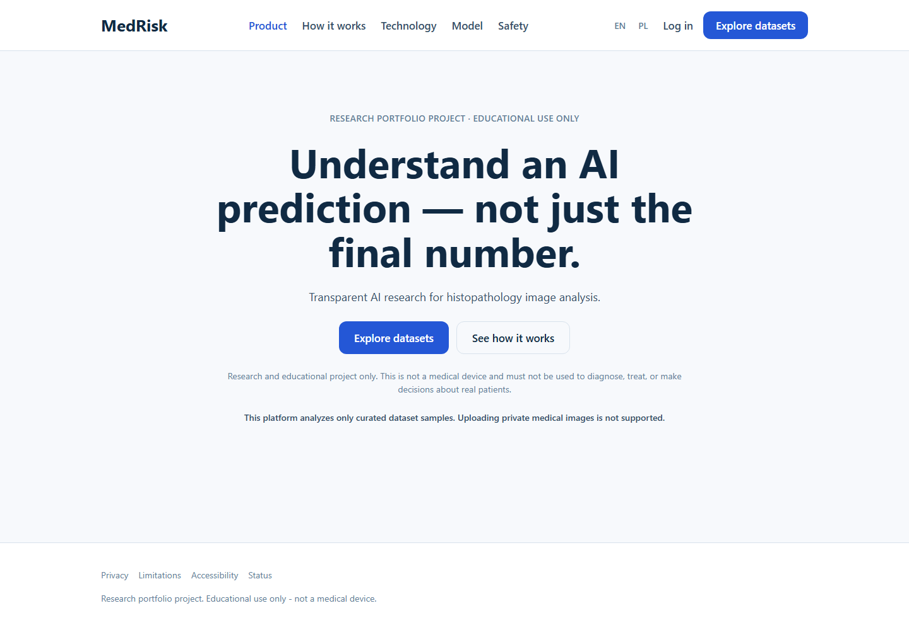

**Purpose.** First-contact framing: what this project is, and what it explicitly is not. The
research-only disclaimer ("not a medical device... must not be used to diagnose, treat, or make
decisions about real patients") appears directly under the headline, not in a footer.
**Data displayed.** Static marketing copy plus the standing disclaimer text sourced from the
frontend's `common.json` `disclaimer` key — the same string used everywhere else in the app.
**Actions available.** "Explore datasets" and "See how it works" both route to public pages
(the dataset explorer itself requires login; an unauthenticated visitor is redirected to
`/login` with the original destination preserved). Top navigation links to the public
informational pages (`/how-it-works`, `/technology`, `/model`, `/privacy`, `/limitations`,
`/accessibility`, `/status`) and to login/register.
**Authorization.** Fully public, no token required.
**Limitations.** Marketing-style framing necessarily simplifies; the precise technical claims
live in the linked documentation, not on this page.

## Public informational pages

`/how-it-works`, `/technology`, `/model`, `/privacy`, `/limitations`, `/accessibility`,
`/status` are all rendered by the same `InfoPage` component with a different content key
(`pageKey`), each pulling its copy from `common.json`. The `/model` page is the most
important of these: it states explicitly that the currently active model is a synthetic
smoke-test bundle and that "predictions have no medical meaning whatsoever." All seven are
public, read-only, and require no authentication.

## Register (`/register`) and login (`/login`)

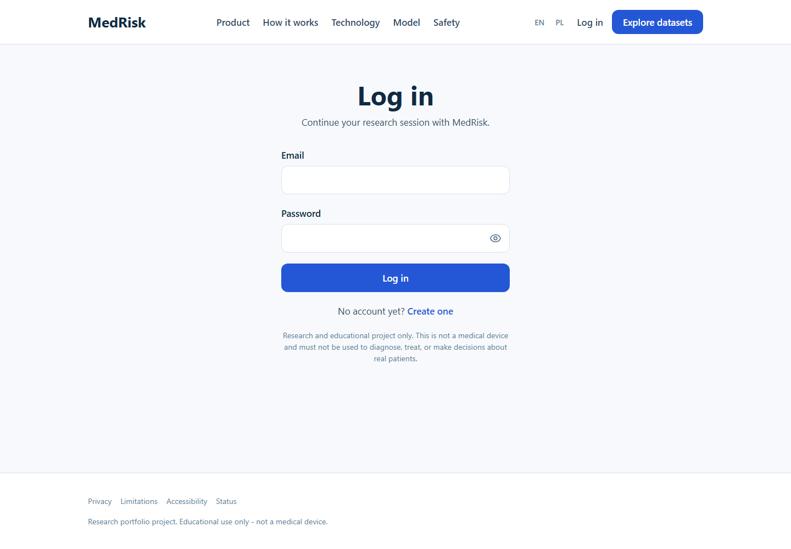

**Purpose.** Account creation and session start. **Data displayed.** A form (full name, email,
password, confirm password) plus a mandatory checkbox: "I understand [MedRisk] is a research
and educational project, not a medical device, and I will not upload personal or identifying
medical information." Registration cannot complete without checking it (`zod`-enforced
`z.literal(true)` on `acceptedResearchNotice`). **Endpoint.**
`POST /api/v1/auth/register` then `POST /api/v1/auth/login` (the frontend immediately logs in
after a successful registration). **Validation.** Password policy enforced both client-side
(`buildPasswordSchema`) and server-side; duplicate email returns a generic `CONFLICT` error
that does not confirm or deny which field was wrong beyond that. **Rate limiting.** Both
endpoints are rate-limited per process (Phase 8) to reduce (not eliminate) credential-stuffing
and registration-spam risk — see [KNOWN_LIMITATIONS.md](KNOWN_LIMITATIONS.md) for what this
does not cover (no distributed limiting, no account lockout).

## Dashboard (`/app`)

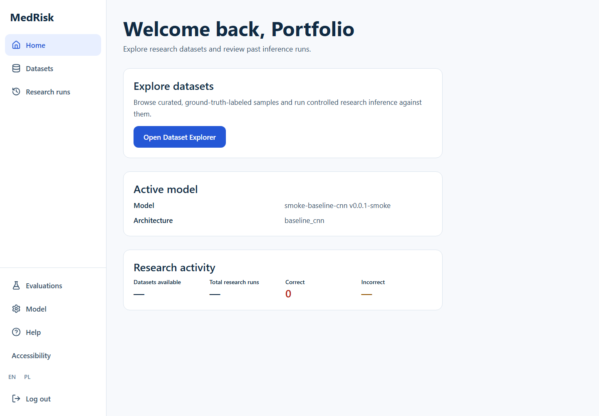

**Purpose.** Authenticated landing page summarizing the account's research activity.
**Data displayed.** A welcome message with the user's first name; the currently active model's
name, version, and architecture (`GET /api/v1/models/active`); and four counters — datasets
available, total prediction runs, correct, and incorrect — each independently queried from
`GET /api/v1/predictions/history` with different filters (e.g. `limit=1&isCorrect=true` to read
just the `total` count cheaply). **Actions.** A single call to action into the dataset explorer.
**Authorization.** Requires a valid bearer token (`ProtectedRoute` client-side, `CurrentUserDep`
on every underlying endpoint). **Limitations.** The stat cards show an em-dash while their
query is loading or has never run; a brand-new account legitimately shows zeroes everywhere.

## Dataset explorer (`/app/datasets`)

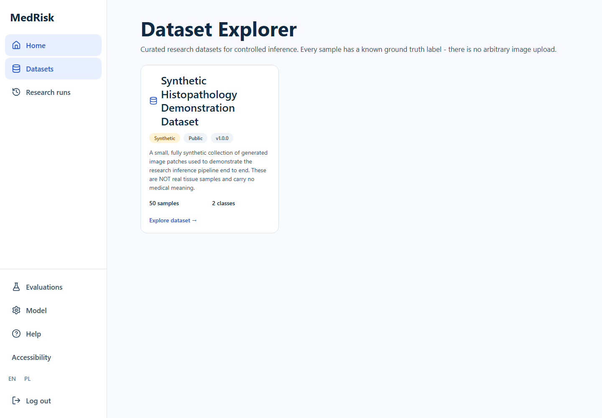

**Purpose.** Browse every dataset registered in the platform's dataset registry (Phase 6).
**Data displayed.** One card per `Dataset` row: name, version, synthetic/public badges, short
description, sample count, and class count. **Endpoint.** `GET /api/v1/datasets`.
**Authorization.** Authenticated; the endpoint itself is read-only and scoped to public
datasets. **Interpretation.** A dataset's "Synthetic" badge is not cosmetic — it is read
directly from `Dataset.is_synthetic` and means the data was procedurally generated, not
photographed tissue.

## Dataset detail (`/app/datasets/:datasetId`)

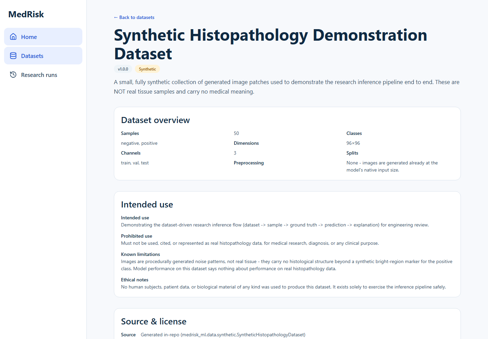

**Purpose.** Full provenance and governance information for one dataset before a reviewer runs
anything against it. **Data displayed.** Sample/class counts, image dimensions and channels,
declared splits, intended use, prohibited use, known limitations, ethical notes, and source/
license information — all columns on the `Dataset` row, not freeform marketing text.
**Endpoint.** `GET /api/v1/datasets/{id}`. **Why this page exists.** It is the dataset-card
analogue of a model card: a reviewer should be able to read what a dataset is and is not for
before seeing a single prediction from it.

## Dataset sample detail (`/app/datasets/:datasetId/samples/:sampleId`)

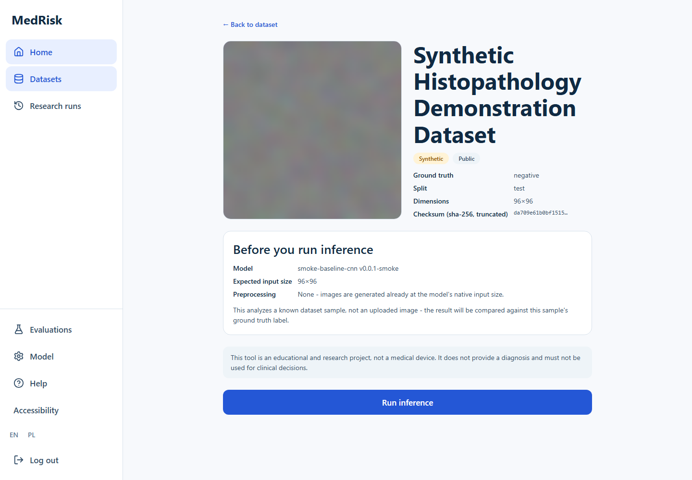

**Purpose.** Inspect one specific, ground-truth-labeled sample and optionally run inference
against it. **Data displayed.** The sample image, its ground truth label, split, dimensions,
and a truncated SHA-256 checksum; below that, the active model's name, version, and expected
input size, so a reviewer knows what will run before running it. **Actions.** "Run inference"
triggers `POST /api/v1/datasets/{datasetId}/samples/{sampleId}/predict`. **Validation.** The
sample image is never client-supplied — the server resolves it from `DatasetSample.relative_path`
internally, so there is no way to submit an arbitrary file through this flow. **Rate
limiting.** This endpoint shares the inference rate limit with the legacy upload-based
prediction endpoint.

## Prediction result (`/app/predictions/:predictionId`)

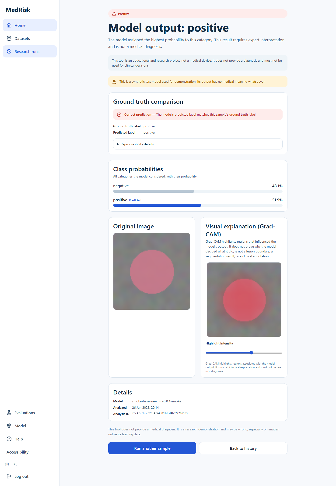

**Purpose.** The full output of one inference run. **Data displayed, top to bottom:** the
model's output decision and a plain-language note that the result "requires expert
interpretation and is not a medical diagnosis"; the synthetic-model disclaimer; a ground-truth
comparison panel stating explicitly whether the prediction matched the sample's known label;
full class probabilities as a bar chart; the original image alongside the Grad-CAM visual
explanation, with a highlight-intensity legend; and a details panel (model id/version,
timestamp, analysis ID). **Endpoint.** `GET /api/v1/predictions/{id}`, scoped to the
requesting user (`user_id` filter in `app/services/prediction.py`) — one user cannot read
another's prediction by guessing an ID. **Interpretation of Grad-CAM.** The heatmap highlights
regions that influenced the model's score for the displayed class; it does not indicate that
the model has identified a clinically meaningful structure, and the page's disclaimer says so.
**Limitations.** If explanation generation fails, the page is designed to still show the
prediction with an explicit `explanation_status` rather than failing the whole page — this
project did not need to exercise that path during this review, but the contract exists in the
schema and is unit-tested.

## Prediction history (`/app/predictions`)

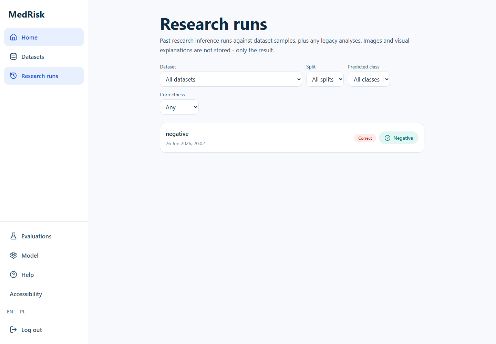

**Purpose.** A filterable, paginated log of every inference run made by the current account.
**Data displayed.** Predicted class, timestamp, a correct/incorrect badge (when the prediction
has a known ground truth) or a "legacy" tag (for predictions made before Phase 6 introduced
ground-truth comparison), and the decision badge (`negative`/`positive`/`review_required`).
**Filters.** Dataset, split, predicted class, correctness — all passed as query parameters to
`GET /api/v1/predictions/history`. **Authorization.** User-scoped; the same `user_id` filter as
the detail page. **Empty state.** A first-time account sees an explicit empty state with a link
back into the dataset explorer rather than a blank list.

## Research evaluation overview (`/app/research`)

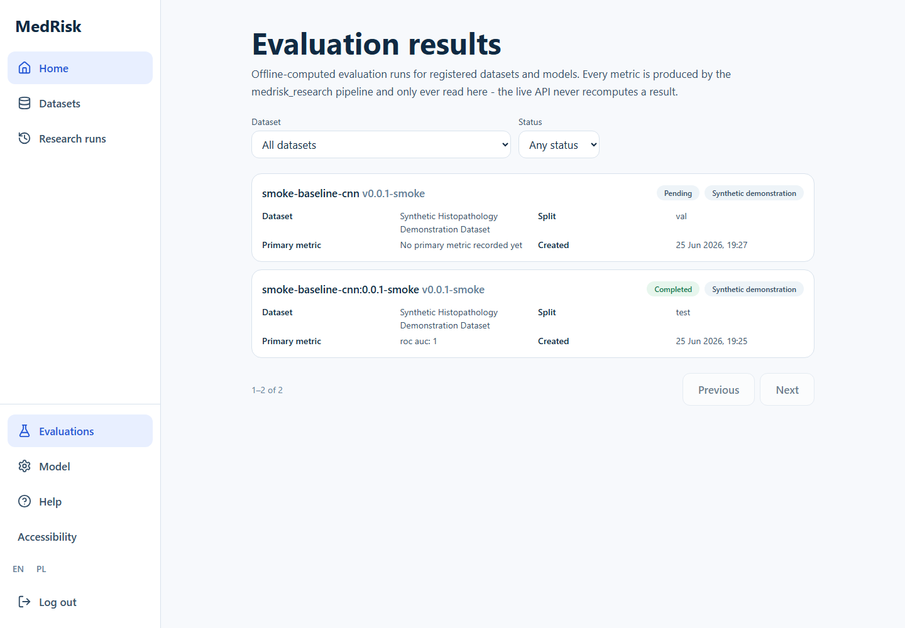

**Purpose.** Browse every persisted, offline-computed evaluation run. **Data displayed.** Per
run: model id/version, status (pending/running/completed/failed/cancelled/invalidated), a result
classification badge (e.g. "Synthetic demonstration" — never a color-ranked "good/bad" badge,
by design, see [THREAT_MODEL.md](THREAT_MODEL.md) threat #24), dataset name, split, primary
metric (when available), and creation date. **Filters.** Dataset and status, both server-side
query parameters against `GET /api/v1/research/evaluations`. **Authorization.** Read endpoints
require only authentication — any registered user can browse evaluation results; only an
administrator can *create* one (see below). **Interpretation.** "Offline-computed" is not a
disclaimer of convenience: the live API process has no `numpy`/`scikit-learn` dependency, so it
is structurally incapable of computing a metric itself — every number here was written by the
`medrisk_research`/`medrisk_ml` offline pipeline and is only ever read back.

## Research evaluation detail (`/app/research/:evaluationId`)

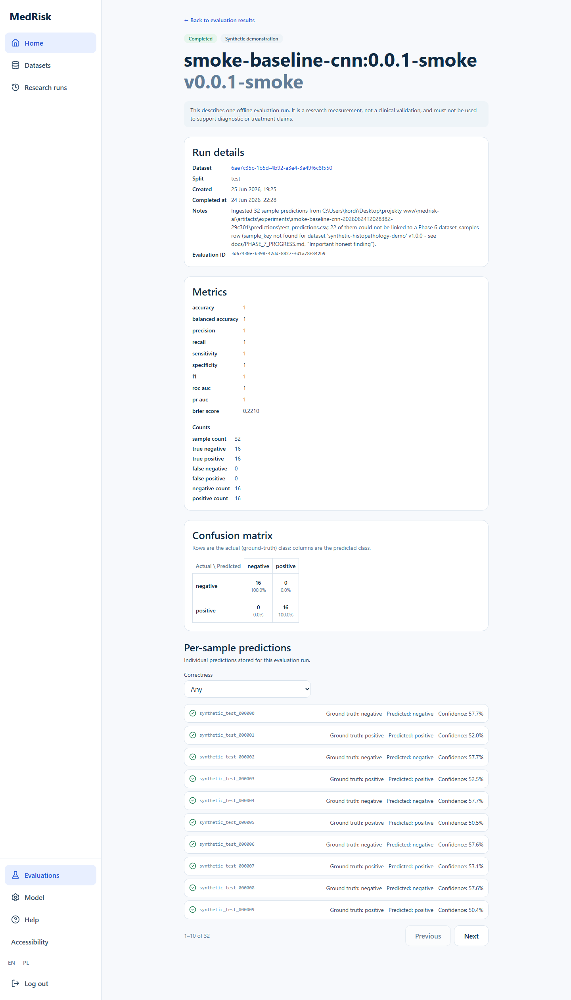

**Purpose.** The full record of one completed evaluation run. **Data displayed.** Run details
(dataset, split, created/completed timestamps, evaluation ID, and any ingestion notes — e.g.
how many sample predictions could not be resolved to a registry row); a metrics panel (every
implemented scalar metric plus confusion-matrix counts, see
[PORTFOLIO_CASE_STUDY.md](PORTFOLIO_CASE_STUDY.md#10-implemented-metrics) for definitions); a
confusion matrix with row-normalized percentages; and a paginated, filterable (correct/
incorrect) table of every individual sample prediction. **Endpoints.**
`GET /api/v1/research/evaluations/{id}`, `.../metrics`, `.../confusion-matrix`, `.../errors` —
four separate calls, each independently cacheable and independently a 404 if the run does not
exist or is not yet completed. **Authorization.** Read-only, requires authentication; creating
this record requires `is_superuser` (`POST /api/v1/research/evaluations`), which this project's
public demo account does not have. **Interpretation.** A `pending` run (no metrics yet) renders
an explicit "no completed metrics" message rather than an empty or misleading chart.

## Account preferences (`/app/preferences`)

Accessibility preferences (text size, contrast, motion) persisted to `localStorage` and applied
before first paint via an inline script in `index.html`, so there is no flash of default styling
on reload. No personal data beyond these three UI preferences is stored here.

## Mobile layout

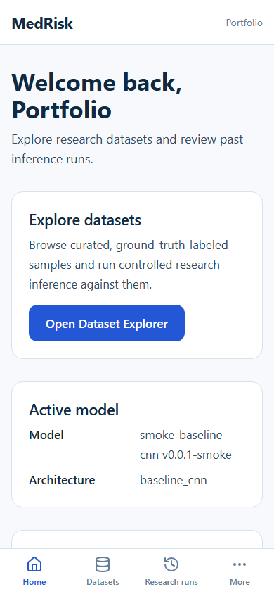
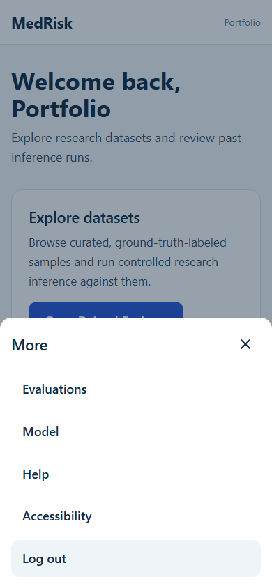
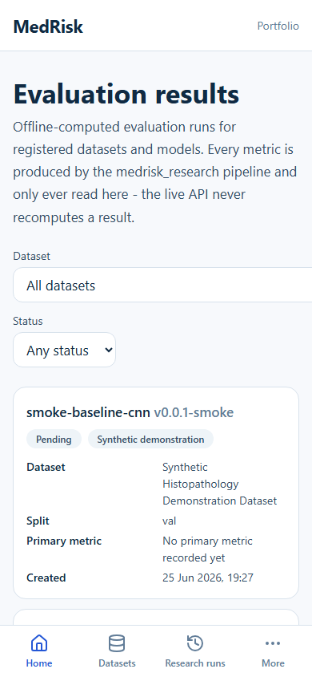

Below the `lg` breakpoint, `AppShell` replaces the desktop sidebar with a fixed bottom
navigation bar (Home, Datasets, Research runs, More) and a top header showing the account's
first name. "More" opens a bottom sheet (Radix `Dialog`) with the remaining destinations
(Evaluations, Model, Help, Preferences, Logout) rather than cramming everything into the bottom
bar. Every page above renders the same data through the same endpoints at this width — there is
no separate mobile API or reduced feature set, only a different navigation shell.

## What this walkthrough does not cover

The "Active model" (`/app/model`) and "Help" (`/app/help`) sidebar destinations currently render
a placeholder `ComingSoonPage` — they are real routes with no fabricated content behind them,
not broken links. The `/api/v1/predictions/survival` endpoint exists in the API but has no
corresponding frontend page, by design (it returns an honest `501`).
