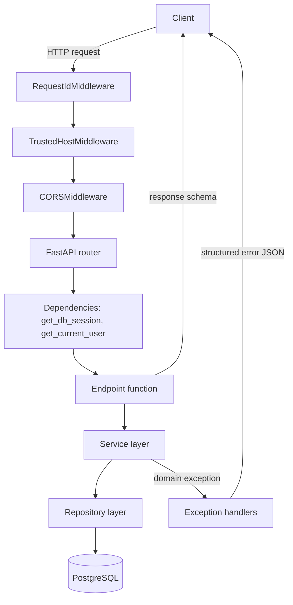
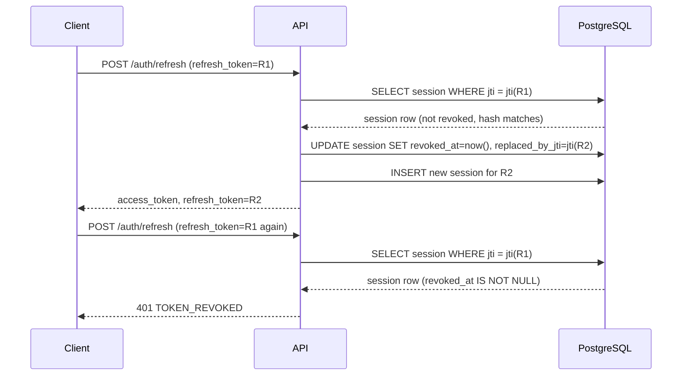

# Architecture

MedRisk AI's backend is a modular monolith: one deployable application, internally split into clearly bounded layers. There is no microservice split in Phase 1 — at this scale it would add operational cost without a corresponding benefit.

## Layers

```text
app/
├── api/          HTTP layer: routers, FastAPI dependencies, request/response wiring
├── core/         Cross-cutting concerns: config, security, logging, exceptions
├── db/           SQLAlchemy base class, async engine, per-request session factory
├── middleware/   ASGI middleware (request ID)
├── models/       SQLAlchemy ORM models (the database schema, in Python)
├── repositories/ Database access functions (no HTTP concepts, no business rules)
├── schemas/      Pydantic request/response models (the API contract)
└── services/     Business logic (registration, login, token rotation, ...)
```

**Direction of dependency:** `api` → `services` → `repositories` → `models`/`db`. `core` is used by everything. Nothing in `services` or `repositories` imports from `api`, and nothing in `models`/`repositories` raises an HTTP-flavored exception — that mapping happens once, centrally, in `app/main.py`'s exception handlers.

## Request flow



Each box is a real module boundary you can `Read` in this repo: `RequestIdMiddleware` is [app/middleware/request_id.py](../app/middleware/request_id.py), the dependencies are [app/api/dependencies.py](../app/api/dependencies.py), and the exception handlers are registered in [app/main.py](../app/main.py).

## API layer

Routers live under `app/api/v1/endpoints/` (`auth.py`, `health.py`, `users.py`, `predictions.py`, `models.py`) and are aggregated in `app/api/v1/router.py`, mounted under `API_V1_PREFIX` (default `/api/v1`) by `app/api/router.py`. Health/root routes are deliberately **not** versioned. Endpoint functions are thin: parse input (via a Pydantic schema), call a service function, map the result to a response schema. They contain no SQL and no token logic.

## Service layer

`app/services/auth.py` and `app/services/prediction.py` hold the actual business rules: "a duplicate email is a conflict," "a revoked refresh token must reject reuse," "history is always scoped to the calling user." Service functions take an `AsyncSession` and (where needed) `Settings` as explicit arguments — no hidden global state — which is what makes them straightforward to unit-test independently of HTTP.

## Repository layer

`app/repositories/*.py` are plain async functions wrapping SQLAlchemy queries (`select`, `session.get`, etc.). They never raise `HTTPException` or any domain exception — a repository function returns `None` for "not found," and it is the service layer's job to decide whether that is an error.

## SQLAlchemy session lifecycle

There is exactly one `AsyncEngine` per process (`app/db/session.py`), created once at import time — engines own a connection pool and are meant to be shared. There is **never** a shared `AsyncSession`: the `get_db_session` FastAPI dependency creates a fresh session for every single request, yields it to the endpoint (transitively, to the service/repository calls within that request), and closes it when the request ends — rolling back first if the request raised.

```python
async def get_db_session() -> AsyncGenerator[AsyncSession, None]:
    async with AsyncSessionLocal() as session:
        try:
            yield session
        except Exception:
            await session.rollback()
            raise
        finally:
            await session.close()
```

**Transaction boundary:** the service layer commits. Repository functions call `add()`/`flush()` so the service layer can see assigned IDs and database-computed defaults (like `created_at`), but only a service function calls `session.commit()` — usually as the last step of a function that may have made several repository calls that must succeed or fail together (e.g. revoking an old refresh session and creating its replacement during rotation).

## Auth flow

1. **Register** (`POST /auth/register`): normalize email, hash the password with Argon2, persist the user.
2. **Login** (`POST /auth/login`): verify credentials (generic error on any failure), issue an access token (short-lived) and a refresh token (long-lived), persist a `RefreshTokenSession` row holding only a SHA-256 fingerprint of the refresh token.
3. **Authenticated request**: `get_current_user` (in `app/api/dependencies.py`) extracts the Bearer token, verifies it's a well-formed, correctly-signed, non-expired `access` token for an active user.
4. **Refresh** (`POST /auth/refresh`): verify the refresh JWT, look up its session by `jti`, check it hasn't been revoked, verify the stored hash matches (constant-time comparison), then **rotate**: revoke the old session and issue a brand-new access+refresh pair.
5. **Logout** (`POST /auth/logout`): revoke the refresh session. Idempotent — logging out twice is not an error.

See [security.md](security.md) for the full token-claim list and rotation/revocation rules.

## Refresh-token rotation



## Database flow

Schema changes only ever happen through Alembic migrations (`alembic upgrade head`) — the application never calls `Base.metadata.create_all()` at startup. See [database.md](database.md) for the table-by-table schema and migration workflow.

## Histopathology inference (Phase 3)

A loaded PyTorch model is process-wide shared state, unlike anything Phase 1 needed — it lives on `app.state`, built once in `lifespan()` and never reloaded per request. This is a large enough addition (a new package, a new lifecycle, new concurrency/upload/security concerns) to warrant its own document: see [inference-architecture.md](inference-architecture.md), plus [image-input-contract.md](image-input-contract.md), [model-deployment.md](model-deployment.md), and [inference-security.md](inference-security.md).

## Error handling

Four exception handlers, registered once in `app/main.py`:

| Exception | Status | Source |
|---|---|---|
| `AppError` (and subclasses: `ConflictError`, `AuthenticationError`, `TokenExpiredError`, `TokenRevokedError`, `AuthorizationError`, `ResourceNotFoundError`, `ServiceUnavailableError`, `ModelNotConfiguredError`, `ModelUnavailableError`, `InferenceQueueFullError`, `InferenceTimeoutError`, plus dynamically-coded instances created via `AppError(..., status_code=..., error_code=...)` for the many `medrisk_inference` error codes — see [inference-architecture.md](inference-architecture.md#error-codes)) | varies (401/403/404/409/429/503/504, and more) | Raised explicitly by services |
| `RequestValidationError` | 422 | Raised by FastAPI/Pydantic for malformed request bodies |
| `StarletteHTTPException` | varies | FastAPI's own `HTTPException`, and framework defaults (404, 401 from `OAuth2PasswordBearer`, ...) |
| `Exception` (catch-all) | 500 | Anything unexpected — logged with a stack trace server-side, never shown to the client |

`AppError.__init__` accepts optional `status_code`/`error_code`/`headers` overrides on top of its subclass-level defaults — used by `InferenceQueueFullError` to attach a `Retry-After` header, and by `app/services/prediction.py::translate_inference_error` to map the open-ended set of `medrisk_inference` error codes onto HTTP statuses without needing one exception subclass per code.

Every response funnels through the same envelope:

```json
{
  "error": {
    "code": "AUTH_INVALID_CREDENTIALS",
    "message": "Invalid email or password.",
    "details": null,
    "request_id": "9cd1c3e1824548caa292f092dcb0d803"
  }
}
```

## Request IDs

`app/middleware/request_id.py` is a plain ASGI middleware (not `BaseHTTPMiddleware`, to avoid a known issue where contextvars can be lost across the task boundary `BaseHTTPMiddleware` introduces). It accepts a caller-supplied `X-Request-ID` if present and looks safe (`^[A-Za-z0-9_-]{1,128}$`), otherwise generates one. The ID is exposed two ways: via `request.state.request_id` (for exception handlers, which have a `Request`) and via a `contextvar` consumed by the logging formatter (for repository/service code, which doesn't have a `Request`). Every response carries the same ID back in an `X-Request-ID` header.
