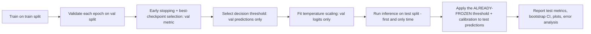

# Experiment protocol

This document is the contract that [medrisk_ml/evaluation/evaluator.py](../medrisk_ml/evaluation/evaluator.py) and [medrisk_ml/evaluation/thresholding.py](../medrisk_ml/evaluation/thresholding.py) enforce in code, not just in prose.

## The core rule: the test split is used exactly once

Three splits exist (`train`, `val`, `test`) and they have three different, non-overlapping jobs:

| Split | Used for | Never used for |
|---|---|---|
| `train` | Gradient updates | Anything else |
| `val` | Early stopping, decision-threshold selection, temperature-scaling calibration, model/checkpoint selection | Computing the number you report as "final performance" |
| `test` | One final, frozen evaluation, after everything above is already decided | Threshold selection, calibration fitting, hyperparameter choices, early stopping, "let's check how we're doing" during development |

`select_threshold()` (`medrisk_ml/evaluation/thresholding.py`) takes a `split_name` argument and **raises `SplitLeakageError`** if called with `split_name="test"` — this is a runtime guard, not a comment asking developers to be careful. Calibration (`fit_temperature()`, `medrisk_ml/evaluation/calibration.py`) is likewise always fit against validation-split logits inside `run_full_evaluation()`, before test-split inference ever runs.

## Why this order, specifically

If the threshold or calibration were instead chosen by looking at test-split predictions, the reported test metric would be optimistically biased — you'd be measuring "how well did I tune to this exact test set," not "how well does this model generalize." This is the single most common way published ML results quietly overstate performance, and it is exactly what steps D and E above are structured to make structurally impossible here, not just discouraged.

## Threshold selection strategies

Implemented in `medrisk_ml/evaluation/thresholding.py::select_threshold()`, all computed on the validation split only:

| Strategy | What it optimizes | Notes |
|---|---|---|
| `fixed` | N/A — uses `default_threshold` (e.g. `0.5`) as-is | Simplest, least adaptive |
| `youden_j` | `max(TPR - FPR)` over the ROC curve | Balances sensitivity and specificity equally |
| `max_f1` | `max(F1)` over the precision-recall curve | Favors the positive class when classes are imbalanced |
| `target_sensitivity` | Highest threshold that still achieves `target_sensitivity` | For "never miss more than X% of positives" requirements; reports `target_achieved=False` if the target is unreachable on this data rather than silently returning a threshold that doesn't meet it |

## Staged transfer learning (ResNet18)

`configs/ml/resnet18.yaml` runs **Stage A**: ImageNet-pretrained backbone frozen (`model.freeze_backbone=true`), training only the replaced classifier head — a few epochs at a moderate learning rate, since the head is randomly initialized and the backbone's existing ImageNet features need to stay intact while the head catches up. A separate, manually-triggered **Stage B** fine-tunes by unfreezing from a chosen layer (e.g. `--set model.freeze_backbone=false --set model.unfreeze_from_layer=layer4`) at a much lower learning rate (e.g. `5e-5`) — fine-tuning pretrained weights too aggressively risks catastrophically forgetting what the backbone already learned on ImageNet. Neither stage is auto-chained; each is one `train` CLI invocation against an explicit config (or `--set` override), so a real PCam run only ever happens when someone deliberately starts it.

## Early stopping and checkpoint selection

`medrisk_ml/training/early_stopping.py::EarlyStopping` monitors `training.monitored_metric` (default `roc_auc`) on the **validation** split, in the direction given by `training.monitored_mode` (`max`/`min`), with patience `training.early_stopping_patience`. `medrisk_ml/training/trainer.py::fit()` always writes both `checkpoints/best.pt` (highest/lowest validation metric seen so far) and `checkpoints/last.pt` (most recent epoch) — `evaluate`/`explain`/`register` all operate on `best.pt`.

## Reproducibility contract

Every `train` run writes `resolved_config.yaml` (the fully-validated config, including defaults) and `environment.json` (interpreter/library versions, GPU, git commit, the config's `config_hash`) into that experiment's `artifacts/experiments/<experiment_id>/` directory, and appends one row to the JSONL experiment registry (`artifacts/registry/experiments.jsonl`, via `medrisk_ml/registry/registry.py::ExperimentRegistry`) — `status="completed"` or `status="failed"`, never silently dropped. A failed run is recorded, not erased, specifically so the registry reflects what was actually attempted.

## Model selection vs. model registration are different steps

Selecting `best.pt` (by validation metric, automatic, every run) is not the same as registering a model (`medrisk_ml.cli register`, manual, deliberate). Registration additionally requires a completed `evaluate` run (it reads `metrics/metrics.json`) and writes a `ModelManifest` that is explicitly marked `synthetic_only=True` / `eligible_for_demo=False` for any synthetic-data experiment — `ModelRegistry.register()` (`medrisk_ml/registry/registry.py`) refuses to register a manifest claiming both `synthetic_only=True` and `eligible_for_demo=True` at once. A smoke-tested pipeline is not a candidate model; the registry is built so the two can never be confused by accident.

## Reporting requirements

Every `report.md` written by `run_full_evaluation()` includes: the threshold strategy and frozen threshold value, calibration temperature (if used), uncalibrated *and* calibrated test metrics side by side (when calibration is enabled), bootstrap confidence intervals explicitly labeled as describing sampling uncertainty over this one fixed test set (not clinical/deployment uncertainty — different scanners, sites, or patient populations are not represented by resampling the same data), and the full medical disclaimer.
