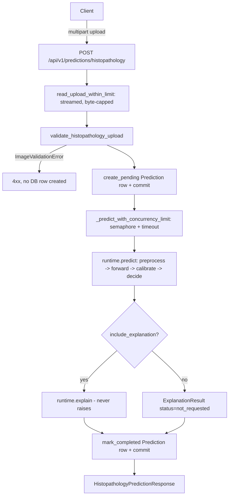

# Inference architecture (Phase 3)

Phase 3 wires the Phase 2 model artifact into the Phase 1 backend through a new, standalone package, `medrisk_inference/`, plus the usual `app/` layers (schemas, services, repositories, endpoints). `app/` and `medrisk_ml/` still never import each other (see [ml-architecture.md](ml-architecture.md)) — `medrisk_inference/` is the only thing that imports from both.

## Layers

```text
medrisk_inference/
├── constants.py        Disclaimers, supported formats, bundle file list
├── exceptions.py        InferenceError + one subclass per failure mode, each with a stable error_code
├── types.py              Frozen dataclasses for every internal result (no Pydantic - see below)
├── config.py             InferenceConfig: a plain dataclass mirroring Settings, decoupled from FastAPI
├── bundle.py             load_bundle(): re-validates a Phase 2 bundle + Phase-3-only checks
├── image_validation.py   validate_image_bytes(): secure decode, EXIF strip, dimension/pixel checks
├── preprocessing.py      Rebuilds the exact Phase 2 inference transform from manifest metadata
├── decision.py           Pure functions: sigmoid/calibration -> probability -> decision
├── explanation.py        Grad-CAM overlay rendering (Pillow/NumPy only, no matplotlib)
├── runtime.py            HistopathologyModelRuntime: the long-lived, in-process model object
├── service.py            validate_upload() / run_validated_inference() / run_inference()
├── utils.py              sanitize_filename()
└── cli.py                Local dev CLI: verify-bundle, warmup, predict, benchmark
```

**Direction of dependency:** `runtime.py` → `{bundle, decision, preprocessing, explanation}` → `{types, exceptions, constants, config}`. Nothing here imports `app.*`; `app/services/model_deployment.py` and `app/services/prediction.py` are the only call sites that import `medrisk_inference`.

**Why dataclasses, not Pydantic, for `types.py`:** these objects never cross a process boundary on their own — the FastAPI layer maps them into `app/schemas/*` response models at the edge. There is no JSON validation to do internally, only a typed contract between pure-Python stages.

**Why a plain dataclass for `config.py`, not `Settings` directly:** `medrisk_inference` must stay importable — and unit-testable, and usable from the CLI — without FastAPI or pydantic-settings. `app/services/model_deployment.py::build_inference_config()` is the one place a `Settings` instance is translated into an `InferenceConfig`.

## Request flow



Each box is real code: the endpoint is [app/api/v1/endpoints/predictions.py](../app/api/v1/endpoints/predictions.py), the upload/validation helpers and the concurrency wrapper are in [app/services/prediction.py](../app/services/prediction.py), and the model-facing half (`predict`/`explain`) is [medrisk_inference/runtime.py](../medrisk_inference/runtime.py).

## Model lifecycle and `app.state`

Phase 1 had no use for `app.state`. Phase 3 introduces exactly two entries, both set once in `app/main.py`'s `lifespan()`:

- `app.state.histopathology_model`: either `None` or an `ActiveHistopathologyModel(runtime, deployment_id, activated_at)` ([app/services/model_deployment.py](../app/services/model_deployment.py)).
- `app.state.inference_semaphore`: an `asyncio.Semaphore(INFERENCE_MAX_CONCURRENCY)`, created once per process.

At startup, `initialize_histopathology_deployment()` does, in order: validate `MODEL_BUNDLE_PATH` is configured → `load_bundle()` → insert a `model_deployments` row (`status=loading`) → build the runtime (`HistopathologyModelRuntime.from_bundle`, which loads weights and optionally warms up) → mark the row `active` and deactivate any previous active row for the same module. Any failure along this chain is recorded on the row (`status=failed`, `failure_code`) before being decided:

| `MODEL_REQUIRED` | Outcome on failure |
|---|---|
| `true` | `ModelStartupError` propagates out of `lifespan()` — the process **does not start**. |
| `false` | The exception is swallowed and logged; `app.state.histopathology_model` stays `None`. The app starts; inference endpoints answer `503 MODEL_NOT_CONFIGURED`/`MODEL_NOT_READY` until a model is configured. |

There is **no hot-swap**: changing `MODEL_BUNDLE_PATH` requires a process restart. See [model-deployment.md](model-deployment.md) for the full operational story, including why.

On shutdown, `lifespan()` calls `runtime.close()` (releases CUDA cache if applicable) before disposing the database engine.

## Request-time dependencies

`app/api/dependencies.py` adds two FastAPI dependencies specific to Phase 3:

- `get_active_histopathology_model` → `ActiveHistopathologyModelDep`. Raises `ModelNotConfiguredError` (503, no bundle path set at all) or `ModelUnavailableError` (503, a model is configured but not currently `ready`) — an endpoint using this dependency never sees a partially-initialized or stale runtime.
- `get_inference_semaphore` → `InferenceSemaphoreDep`. Just reads `request.app.state.inference_semaphore`.

## Database transaction flow

A `pending` `Prediction` row is created and **committed before the model ever runs**:

```python
prediction = await prediction_repo.create_pending(session, ...)
await session.commit()
# ... inference happens here, with no open transaction ...
await prediction_repo.mark_completed(session, prediction, ...)  # or mark_failed
await session.commit()
```

This is deliberate: model inference can legitimately take seconds (cold CPU, large queue wait) and must never hold a database transaction — and therefore locks — open for that duration. The cost is that a request which fails between "row created" and "row completed" leaves a `failed` row rather than no row at all, which is exactly what the audit trail is for. An invalid *upload* (decode failure, wrong dimensions, wrong format, etc.) is rejected by `validate_histopathology_upload()` **before** `create_pending()` is ever called — bad input never produces a row at all.

## The decision pipeline

`medrisk_inference/decision.py` has no PyTorch dependency — it is pure float arithmetic, intentionally, so it is trivial to unit-test exhaustively without a model:

1. **Raw probability** — `sigmoid(logit)`. Always computed and returned (`raw_probability`), even when calibration changes the number used for the actual decision.
2. **Calibrated probability** — `apply_calibration(logit, calibration)`. With no stored `temperature`, this is the same plain sigmoid. With one, it's temperature-scaled: `sigmoid(logit / temperature)`. The temperature is never re-fit at inference time — it is read verbatim from the bundle's `calibration.json`, exactly as Phase 2 computed it on the validation split.
3. **Predicted class** — a plain threshold split on the *calibrated* probability against the bundle's stored `threshold` (never a hardcoded `0.5`).
4. **Decision** — `negative` / `positive` / `review_required`. With a `review_policy` present (`{negative_probability_max, positive_probability_min}`), probabilities landing strictly between the two bounds become `review_required` regardless of which side of `threshold` they fall on. With no review policy, `decision` collapses to mirror `predicted_class`.

`predicted_class` and `decision` can therefore legitimately disagree in the `review_required` band — both are returned, because both are meaningful: `predicted_class` is "what a plain threshold would say," `decision` is "what should actually happen with this result" (route to a human, in that band).

This closes a loop Phase 2 explicitly left open: the model card's homework list noted `review_policy` was a manifest field nothing yet read. Phase 3's `decide()` is that implementation.

## Image validation and preprocessing

See [image-input-contract.md](image-input-contract.md) for the full upload contract. In short: `image_validation.py` decodes with Pillow under a decompression-bomb guard, checks format/dimensions/pixel-count/declared-MIME-vs-actual-format, strips all metadata (EXIF, ICC profiles) by rebuilding a fresh RGB buffer via `Image.frombytes`, and returns a `ValidatedImage` carrying only pixel bytes + a SHA-256 of the original upload — never the original file object, never anything from Pillow's `.info` dict.

`preprocessing.py` then rebuilds *exactly* the Phase 2 inference-time transform (`medrisk_ml.data.transforms.build_transform("inference", ...)`), parameterized only from the bundle's own `manifest.normalization` — no normalization constants are duplicated in `medrisk_inference`. `tests/inference/test_preprocessing.py` asserts this transform matches Phase 2's evaluation transform byte-for-byte on the same input, which is what makes "the model sees in production what it saw during evaluation" more than an assertion in a comment.

When `STRICT_MODEL_INPUT_SHAPE=true` (the default), `service.py::validate_upload()` additionally rejects any upload whose dimensions don't exactly match the bundle's `input_width`/`input_height`. This model classifies pre-cropped patches; it was never evaluated on arbitrary resize-to-fit behavior, and silently resizing an arbitrary upload would invite a distribution shift the model's metrics say nothing about.

## Concurrency control

A single `HistopathologyModelRuntime` instance is shared by every request in the process — there is one model, one set of weights, one device. Two settings bound how many requests may use it at once:

- `INFERENCE_MAX_CONCURRENCY` (default 1): the semaphore's capacity. PyTorch inference on CPU does not benefit from intra-process parallelism the way I/O-bound work does, so the safe default is to serialize.
- `INFERENCE_QUEUE_TIMEOUT_SECONDS` (default 5): how long a request waits for the semaphore before giving up with `429 INFERENCE_QUEUE_FULL` (and a `Retry-After` header).
- `INFERENCE_TIMEOUT_SECONDS` (default 20): once a request *has* the semaphore, how long the actual inference call is allowed to run before `504 INFERENCE_TIMEOUT`.

The blocking PyTorch call itself runs via `asyncio.to_thread(run_validated_inference, ...)` — it never blocks the event loop, so other requests (auth, history reads, health checks) stay responsive while a model forward pass is in flight.

## Error codes

Every `medrisk_inference` exception carries a stable `error_code`. `app/services/prediction.py::translate_inference_error()` maps each to an HTTP status; **4xx codes describe the upload itself and are shown verbatim, 5xx codes are replaced with a single generic message** before reaching the client (the underlying message may describe internal model/runtime state that isn't safe to expose — see [inference-security.md](inference-security.md)).

| Error code | HTTP | Meaning |
|---|---|---|
| `UPLOAD_EMPTY` | 400 | Zero-byte upload |
| `UPLOAD_TOO_LARGE` | 413 | Exceeds `MAX_UPLOAD_BYTES`, enforced while streaming |
| `UNSUPPORTED_IMAGE_FORMAT` | 415 | Not PNG/JPEG |
| `IMAGE_DECODE_FAILED` | 422 | Pillow could not decode the bytes |
| `IMAGE_DIMENSIONS_INVALID` | 422 | Outside min/max bounds, or (strict mode) not an exact match to the model's input shape |
| `IMAGE_PIXEL_LIMIT_EXCEEDED` | 422 | Decompression-bomb guard, or width×height over the configured cap |
| `IMAGE_MULTIFRAME_NOT_SUPPORTED` | 422 | Animated PNG/GIF |
| `IMAGE_MIME_MISMATCH` | 422 | Declared `Content-Type` doesn't match the decoded format |
| `MODEL_NOT_CONFIGURED` | 503 | No `MODEL_BUNDLE_PATH` set |
| `MODEL_NOT_READY` | 503 | A model is configured but not currently loaded/healthy |
| `MODEL_BUNDLE_INVALID` | 503 | Bundle failed verification (startup only — never a per-request code) |
| `MODEL_WARMUP_FAILED` | 503 | Warm-up forward pass failed (startup only) |
| `INFERENCE_QUEUE_FULL` | 429 | Semaphore wait exceeded `INFERENCE_QUEUE_TIMEOUT_SECONDS` |
| `INFERENCE_TIMEOUT` | 504 | Inference exceeded `INFERENCE_TIMEOUT_SECONDS` |
| `MODEL_OUTPUT_INVALID` | 500 | Model produced a non-finite or wrong-shape output |
| `CALIBRATION_FAILED` | 500 | Calibration metadata malformed or produced an out-of-range probability |
| `DECISION_POLICY_INVALID` | 500 | `review_policy`/`threshold` in the bundle failed validation |
| `EXPLANATION_NOT_SUPPORTED` / `EXPLANATION_FAILED` | — | Never surfaced as request errors — `runtime.explain()` catches both and reports `explanation.status="failed"` instead (see below) |
| `INFERENCE_FAILED` | 500 | Catch-all for any exception not already one of the above (a genuine bug, not an expected failure mode) |

## Why Grad-CAM can never fail a prediction

`HistopathologyModelRuntime.explain()` catches `ExplanationFailedError`/`ExplanationNotSupportedError` internally and returns `ExplanationResult(status="failed", ...)` rather than raising. This guarantee lives on the runtime itself (not just in the service layer that happens to call it today) so that *any* future caller — the CLI, a future batch job — gets the same behavior for free: an explanation is a nice-to-have annotation on a successful prediction, never a reason to fail one.

## Key decisions

A handful of choices were deliberate enough to record here rather than leave implicit in the code (the kind of content a separate ADR file would otherwise hold — folded in here instead, since Phase 3 is one cohesive unit of work):

**Synchronous, single-instance runtime instead of a model server / queue.** A dedicated model-serving process (TorchServe, Triton, a Celery worker pool) is the right answer at a scale this project doesn't have. One process, one model, an `asyncio.Semaphore` for backpressure, and `asyncio.to_thread` to keep the event loop free was chosen because it is the simplest thing that is still actually safe under concurrent load — and the seam (`app/services/model_deployment.py` / `medrisk_inference.runtime`) is exactly where a future split would happen, mirroring the same reasoning Phase 1's ADR-001 made about `app/services/prediction.py`.

**Bundle path from configuration only, never from a request.** `MODEL_BUNDLE_PATH` is an environment variable read once at startup. No endpoint accepts a path, a URL, or an upload that becomes a model artifact. This eliminates an entire class of arbitrary-file-read/deserialization attack surface by construction rather than by validation.

**`weights_only=True` on every `torch.load`.** Both the bundle's `model_state.pt` (loaded by `runtime.from_bundle`) and Phase 2's own checkpoints use PyTorch's restricted unpickler — the payload is contractually tensors and simple types, never arbitrary classes, so there is nothing for `weights_only=True` to refuse that the bundle should have contained anyway.

**A three-way decision (`negative`/`positive`/`review_required`) is a first-class output, not a UI affordance bolted on later.** The bundle's `review_policy` band is read at runtime, applied in `decide()`, and stored on the `Prediction` row (`review_lower_bound`/`review_upper_bound`) — a model that ships with no review policy degrades gracefully to a plain two-way split, but the schema and pipeline always have a place for the three-way case, because "tell a human" is a legitimate model output for anything claiming to assist (never replace) a clinical decision.

**Two response shapes for the same data — `HistopathologyPredictionResponse` (POST) vs. flat `PredictionRead` (history/detail).** The POST response is the only place a Grad-CAM image is ever returned, because it is generated fresh per-request and never persisted. History and detail reads are deliberately flat and DB-shaped and **cannot** leak that image, structurally — there is no column for it.

**No FastAPI dependency inside `medrisk_inference`.** Despite the package existing solely to serve an API, it has zero imports of `fastapi`, `pydantic`, or `app.*`. This is what makes `tests/inference/test_import_isolation.py` (a subprocess-based check, not just a manual review) meaningful, and what keeps the CLI (`medrisk_inference/cli.py`) usable for local debugging without spinning up the web app at all.

## Known Phase 3 limitations

- **No model version/library compatibility metadata in the manifest.** `ModelManifest` (Phase 2) has no recorded PyTorch/Python version. `MODEL_STRICT_VERSION_CHECK` exists as a configuration field but currently has no corresponding check to enable — there is nothing yet to strictly check. A real cross-version compatibility guard would need that metadata added to the manifest first; tracked as future work, not silently implemented as a no-op check.
- **No hot-swap, no blue/green model rollout.** Covered in full in [model-deployment.md](model-deployment.md).
- **No request-level rate limiting beyond the inference semaphore.** Auth endpoints still have no rate limiting (a pre-existing Phase 1 limitation; see [security.md](security.md)), and the inference semaphore bounds *concurrency*, not *request rate* — a client can still queue many sequential requests.
- **No Prometheus/metrics endpoint.** Deliberately out of scope for this phase; `app/core/config.py` does not even carry placeholder metrics fields, to avoid implying a capability that isn't there.
