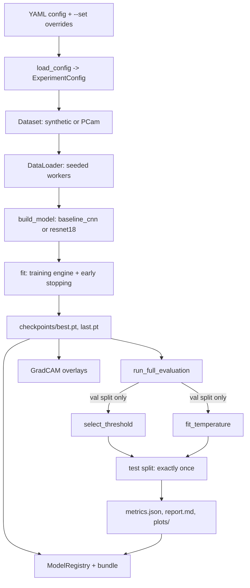

# ML architecture (Phase 2)

`medrisk_ml/` is a standalone Python package, independent of the `app/` FastAPI backend. Nothing in `app/` imports from `medrisk_ml/` and nothing in `medrisk_ml/` imports from `app/` — Phase 2 produces a model artifact; wiring it into the API is Phase 3's job, not this one.

## Layers

```text
medrisk_ml/
├── config.py          Typed, validated experiment configuration (pydantic)
├── constants.py        Disclaimers, paths, env-var names, class names
├── types.py             Shared Literal type aliases + small dataclasses
├── data/                Datasets (real PCam + synthetic), transforms, loaders, metadata
├── models/              BaselineCNN, ResNet18 transfer learning, model factory
├── training/            Loss/optimizer/scheduler, training engine, checkpointing
├── evaluation/          Metrics, thresholding, calibration, plots, error analysis
├── explainability/      Grad-CAM (hooks, core algorithm, overlay rendering)
├── registry/            Experiment registry, model registry, portable model bundle
├── utils/                Device resolution, reproducibility, hashing, logging, timing
└── cli.py                argparse entrypoint tying everything together
```

**Direction of dependency:** `cli.py` → `{data, models, training, evaluation, explainability, registry}` → `utils`. `config.py`/`constants.py`/`types.py` are used by everything. No subpackage under `data/`, `models/`, `training/`, `evaluation/`, or `explainability/` imports from `cli.py` or `registry/` — those two sit on top, not in the middle.

## Pipeline flow



Each box is a real module you can `Read`: configuration is [medrisk_ml/config.py](../medrisk_ml/config.py), the training engine is [medrisk_ml/training/engine.py](../medrisk_ml/training/engine.py) and [medrisk_ml/training/trainer.py](../medrisk_ml/training/trainer.py), final evaluation is [medrisk_ml/evaluation/evaluator.py](../medrisk_ml/evaluation/evaluator.py), Grad-CAM is [medrisk_ml/explainability/gradcam.py](../medrisk_ml/explainability/gradcam.py), and registration is [medrisk_ml/registry/registry.py](../medrisk_ml/registry/registry.py) plus [medrisk_ml/registry/bundle.py](../medrisk_ml/registry/bundle.py).

## Configuration system

Every experiment is one YAML file validated against `ExperimentConfig` (`medrisk_ml/config.py`): `experiment`, `data`, `model`, `training`, `evaluation`, `logging`, `runtime` sections, each a pydantic model with `extra="forbid"` — an unknown key or a typo'd field name is a hard error, not a silently ignored no-op. CLI overrides (`--set training.epochs=2`) are parsed with `yaml.safe_load` per value and merged into the raw dict *before* validation, so an override is checked exactly as strictly as the YAML file itself.

Cross-field invariants are enforced by `@model_validator`, not by convention:

| Rule | Enforced in |
|---|---|
| `runtime.deterministic` and `runtime.benchmark` cannot both be true | `RuntimeSection._deterministic_benchmark_conflict` |
| `data.synthetic` must match `data.dataset_name == "synthetic"` | `DataSection._cross_field_checks` |
| `data.persistent_workers` / `prefetch_factor` require `num_workers > 0` | `DataSection._cross_field_checks` |
| `model.pretrained` / `unfreeze_from_layer` only apply to `resnet18`, never `baseline_cnn` | `ModelSection._architecture_consistency` |
| `evaluation.target_sensitivity` is required exactly when `threshold_strategy="target_sensitivity"` | `EvaluationSection._target_sensitivity_consistency` |

`load_config()` returns a `LoadedConfig` carrying not just the validated `ExperimentConfig` but also a `config_hash` (`stable_hash` over the resolved JSON, `medrisk_ml/utils/hashing.py`) and resolved absolute `output_dir`/`data_dir` paths — the hash is stored alongside every experiment record specifically so two runs can be compared for "did anything about the config actually change."

## Reproducibility

`medrisk_ml/utils/reproducibility.py::set_seed()` seeds Python's `random`, NumPy, and `torch` (CPU + all CUDA devices) from one integer, and optionally forces `torch.use_deterministic_algorithms(True)` plus `CUBLAS_WORKSPACE_CONFIG`. `DataLoader` workers are seeded individually via `seed_worker()` (a `worker_init_fn`) so multi-worker data loading doesn't reintroduce nondeterminism through per-worker RNG state. `collect_environment_metadata()` snapshots interpreter/library versions, GPU name, and the current git commit/dirty-state into every experiment's `environment.json` — the synthetic-data fixtures in `medrisk_ml/data/synthetic.py` go a step further and derive each sample from `np.random.default_rng([seed, split_offset, index])` (an explicit integer tuple), never from Python's built-in `hash()`, because `hash()` on tuples/strings is salted per-process by `PYTHONHASHSEED` and is not stable across runs.

## Device management

`medrisk_ml/utils/device.py::resolve_device()` maps `runtime.device` (`auto`/`cuda`/`mps`/`cpu`) to a concrete `torch.device`, falling back to CPU with a logged warning if `cuda`/`mps` is requested but unavailable — it never silently trains on the wrong device without telling you. `auto` prefers CUDA, then MPS, then CPU. `ResolvedDevice.supports_amp` gates whether the training engine is allowed to use `torch.autocast`/`GradScaler` (mixed precision is only meaningful on CUDA in this codebase).

## Model contract

Both architectures (`medrisk_ml/models/baseline_cnn.py`, `medrisk_ml/models/resnet.py`) return raw logits of shape **`(batch, 1)`** — never `(batch,)`, never post-sigmoid probabilities. The squeeze to `(batch,)` happens in exactly one place, [medrisk_ml/training/engine.py](../medrisk_ml/training/engine.py)`::_forward_logits()`, immediately before the loss is computed. This is deliberate: `BCEWithLogitsLoss` silently broadcasts a `(B, 1)` prediction against a `(B,)` target into a `(B, B)` loss matrix instead of raising — fixing the shape in one tested chokepoint, rather than trusting every call site to get it right, is what prevents that bug from ever reappearing.

`medrisk_ml/models/factory.py::build_model()` is the only place that should be called by application code — it dispatches on `architecture`, attaches a `ModelMetadata` (parameter counts), and `get_target_layer()` resolves the correct Grad-CAM target layer per architecture (`layer4` for `resnet18`, the last conv block for `baseline_cnn`) so calling code never hardcodes a layer name.

## FastAPI integration (Phase 3)

Phase 2 produces a portable, self-verifying model bundle (`medrisk_ml/registry/bundle.py`) precisely so that Phase 3 can load it without depending on any Phase-2-only code (training loops, dataset classes, the CLI) — keeping the model finalization step (threshold, calibration, frozen per [experiment-protocol.md](experiment-protocol.md)) decoupled from the API integration step. That integration is now built: a new package, `medrisk_inference/`, consumes a bundle exactly the way this document's "Model contract" describes it, with no changes made to `medrisk_ml/` itself to support it. See [inference-architecture.md](inference-architecture.md) for the full Phase 3 design, including which `medrisk_ml` submodules `medrisk_inference` is (and is deliberately not) allowed to import.
