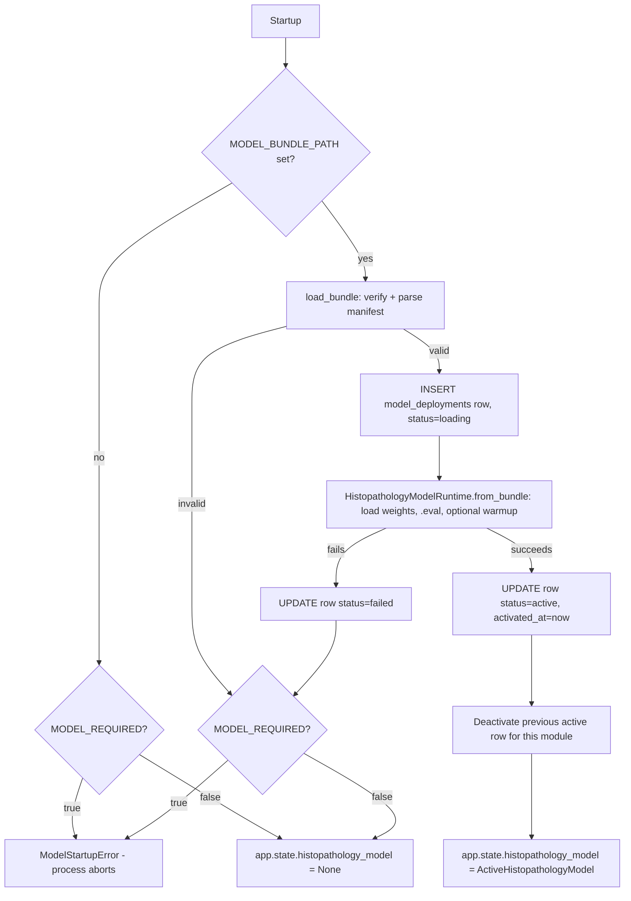

# Model deployment

How a Phase 2 model bundle becomes "the active model" an API request can hit, what gets recorded along the way, and how to operate this in practice.

## What a bundle is

A directory produced by `medrisk_ml.registry.bundle.build_bundle()` (Phase 2), containing exactly the files in `BUNDLE_FILES` — `model_state.pt`, `manifest.json`, `preprocessing.json`, `threshold.json`, `calibration.json`, `model_card.md`, `SHA256SUMS`. Phase 3 never builds, edits, or registers a bundle; it only *consumes* one. See [ml-architecture.md](ml-architecture.md) for how a bundle is produced.

## Configuration

| Setting | Default | Meaning |
|---|---|---|
| `MODEL_BUNDLE_PATH` | unset | Filesystem path to the bundle directory. The **only** way a model path reaches this system — never a request parameter, never user input. |
| `MODEL_REQUIRED` | `false` | Whether a failed/missing model load is fatal at startup (see below). |
| `MODEL_DEVICE` | `auto` | `auto` / `cpu` / `cuda` / `mps`, passed to `medrisk_ml.utils.device.resolve_device()`. |
| `MODEL_WARMUP_ENABLED` | `true` | Run one dummy forward pass at load time so the first real request isn't the one paying for lazy CUDA/cuDNN initialization. |
| `ALLOW_SYNTHETIC_MODEL` | `false` | Required (alongside `ENVIRONMENT=development`) to load a bundle with `synthetic_only=true` outside of `ENVIRONMENT=test`. |
| `MODEL_STRICT_VERSION_CHECK` | `true` | Reserved — see the limitation noted in [inference-architecture.md](inference-architecture.md#known-phase-3-limitations). |

## Startup sequence

`app/main.py`'s `lifespan()` calls `initialize_histopathology_deployment(session, settings)` ([app/services/model_deployment.py](../app/services/model_deployment.py)) exactly once, before the app starts serving:



Every attempt — successful or not — gets its own `model_deployments` row. Rows are never deleted when a new model activates, only superseded (`status` flips to `inactive`, `deactivated_at` stamped) — the table is a durable "what was active when" audit trail, not just a pointer to the current model.

## `model_deployments` table

| Column | Notes |
|---|---|
| `id`, `created_at`, `updated_at` | Standard. |
| `module` | `histopathology` \| `survival` (native enum, shared with `predictions.module`). |
| `model_id`, `model_name`, `model_version` | From the bundle's manifest. |
| `bundle_path` | **Internal administration only — never returned by any API response.** |
| `bundle_sha256` | Checksum of `SHA256SUMS` itself, i.e. a fingerprint of the whole verified bundle. |
| `architecture`, `dataset_name`, `dataset_mode`, `synthetic_only`, `eligible_for_demo` | Mirrors of manifest fields, denormalized here so deployment history doesn't require re-reading old bundles from disk. |
| `device` | What `MODEL_DEVICE` resolved to at the time. |
| `status` | `loading` \| `active` \| `inactive` \| `failed`. |
| `loaded_at`, `activated_at`, `deactivated_at` | Lifecycle timestamps; nullable, set as the row progresses. |
| `warmup_completed`, `warmup_duration_ms` | From `RuntimeHealth` once warm-up runs. |
| `failure_code` | Set only on `status=failed`, holding an `error_code` (e.g. `MODEL_BUNDLE_INVALID`), never a raw stack trace. |

## Single model per process — no hot-swap

There is exactly one `HistopathologyModelRuntime` per process, built once at startup and never reloaded while the process is running. Switching models means changing `MODEL_BUNDLE_PATH` and **restarting the process** — there is no admin endpoint, no signal handler, no file-watcher that swaps the model underneath in-flight requests.

This is a deliberate simplification, not an oversight:

- A hot-swap needs to answer "what happens to a request that's mid-inference when the swap happens" and "how do two model generations' memory footprints coexist briefly" — real questions, but ones a single-model educational/portfolio deployment doesn't need to answer yet.
- `Dockerfile.inference` runs exactly one Uvicorn worker (`--workers 1`) for the same reason multiplied: each worker process would load its own independent copy of the model into memory, so the "one model per process" rule is really "one model, period," at this deployment's current scale. Raising `--workers` without first reasoning about per-worker memory and the fact that each gets an independent semaphore (concurrency limits are process-local, not shared) would silently break the documented concurrency guarantees in [inference-architecture.md](inference-architecture.md#concurrency-control).

## Operating it locally

```bash
# Inspect a bundle without loading it into the app at all
python -m medrisk_inference.cli verify-bundle --bundle-path artifacts/model_registry/smoke-baseline-cnn/0.0.1-smoke

# Load it, run warm-up, report timing
python -m medrisk_inference.cli warmup --bundle-path artifacts/model_registry/smoke-baseline-cnn/0.0.1-smoke

# Run one prediction against a local image file
python -m medrisk_inference.cli predict --bundle-path <bundle> --image patch.png --include-explanation

# Run the app itself against it
MODEL_BUNDLE_PATH=artifacts/model_registry/smoke-baseline-cnn/0.0.1-smoke ALLOW_SYNTHETIC_MODEL=true \
    uvicorn app.main:app --reload
```

The only bundle that ships in this repository (`artifacts/model_registry/smoke-baseline-cnn/0.0.1-smoke`) is Phase 2's synthetic smoke-test model: `synthetic_only=true`, `eligible_for_demo=false`. It loads only with `ALLOW_SYNTHETIC_MODEL=true` and `ENVIRONMENT` other than `production` (enforced twice — once by `Settings.validate_production_model_policy`, once again defensively by `InferenceConfig.synthetic_model_allowed` inside `medrisk_inference` itself, which doesn't trust the app layer to have gotten it right). **It has no medical meaning whatsoever** — see [security.md](security.md) and [ml-architecture.md](ml-architecture.md).

## Production posture

`Settings.validate_production_model_policy` hard-fails configuration validation itself (before the app even reaches `lifespan()`) if `ENVIRONMENT=production` and either `ALLOW_SYNTHETIC_MODEL=true` or `MODEL_REQUIRED=false`. In words: **a production deployment of this system cannot start without committing, in configuration, to running a real, non-synthetic model that is required to load successfully.** There is no implicit "production, but the inference endpoints just 503 forever" mode — that would be indistinguishable from a misconfiguration, so it's rejected as one.
